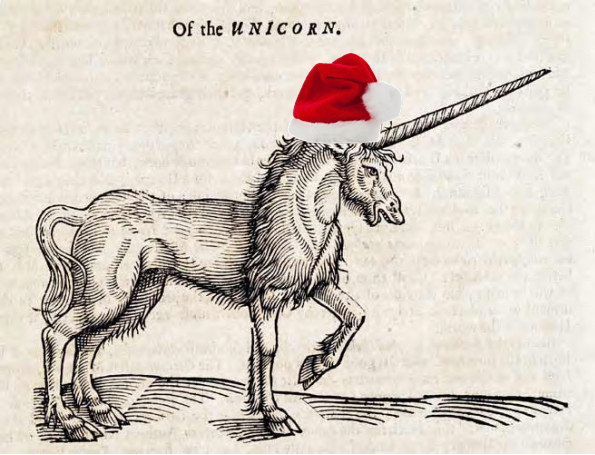
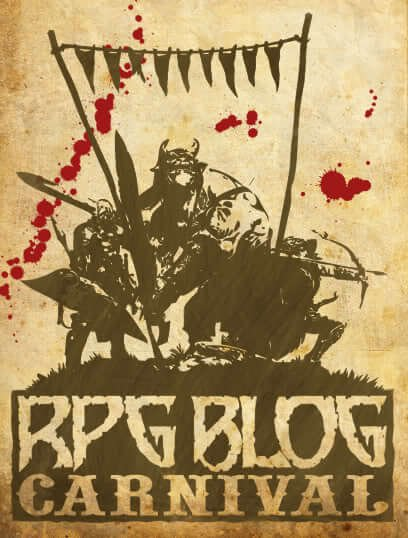

+++
title = "Secret Santicorn, A History"
date = 2025-07-30

[taxonomies]
tags = ["Tabletop Roleplaying Games", "Secret Santicorn", "OSR", "TTRPG History", "Christmas in July"]
ttrpg = ["Secret Santicorn", "OSR", "History", "Midsummer Santicorn"]
+++

With the end of July upon us, the seventh month of the year is coming to a close and I have decided to challenge myself to write more blog posts (gestures to empty blog).
I started this blog with a [response to a writing prompt](@/the-elves-revolt.md) from Archon's Secret Santicorn 2024 community blogging event in the [OSR Discord](https://discord.gg/6vqF25E), and back then I mused among others about delivering some of the publicly missing responses to writing prompts, or "sniping" as they call it in the OSR Discord.

So I decided to deliver some Secret Santicorn wishes that have gone unfulfilled as a personal challenge.
A midsummer Santicorn if you will.

It's *Christmas in July*!

<!--[Santa_sunglasses_color_smaller.jpg](Santa_sunglasses_color_smaller.jpg)-->

<!-- more -->

With my declaration made,
    I'll briefly share my research into the Secret Santicorn event to kick start this challenge.
After a year into the indie scene of TTRPGs and traversing the World Wide Web for information about games from the TTRPG blogosphere to forums to Reddit and more, I have found that compilation and survey efforts are _extremely_ useful.
I've never felt the chaos of so many undocumented and unorganized works until I got into the TTRPG blogosphere, which is saying something because I'm a researcher by occupation!
I think it goes to show how valuable organization and documentation is for learning, especially in combination with computers these days.

## What is the Secret Santicorn?

The Secret Santicorn is an annual seasonal blogging event hosted in the OSR Discord.
People submit a writing prompt as their wish for someone to write a blog about and then after a set date early in December, the prompts are shuffled and then given in secret by the organizer across the prompt-providers.
Each prompt-provider then writes a blog post in response to the randomly assigned prompt given to them.
Most writers publicly inform the recipient -- the original prompter -- of their completed response blog.
This fun event is about fostering creation for others in our shared TTRPG hobby.
A jolly good time!

Blogs are the typical response, however this can also be delivered as a written text document, PDF, or some shared online document, such as Google Docs.
Besides written responses, visual art can also be a valid response depending on the prompt!
The intent is to provide something that matches the prompt well enough to satisfy their wish, but a healthy amount of creative freedom is expected and desired.

The prompts are often short yet request something specific that ignites the imagination.
Their specificity ranges from a few thematic words, such as a couple adjectives and a noun, to an adventure or adventure pieces around a theme, such as creatures, classes, or items,
Advice and rulings are another possibility.
Tables are a common request.
As this is a volunteer community effort for fun, the size and complexity requested is often constrained to something achievable in one or a few sittings.
Given this, the response is left up to artistic freedom and the responder may put in as much effort as they please.

### Santicorn, A Brief History

I joined the Secret Santicorn in 2024, and at that time it was organized into a specialized workshop text channel on the Discord and the prompts were organized by Archon into a publicly shared Google Sheet.
This seems to have been the pattern since 2022, however based on discussion in the Discord the Secret Santicorn has been an annual event since at least 2018 that was hosted elsewhere in the OSR Discord.
There was a "Secret Jackalope" event in Spring of 2020 and 2022 as well.

Before 2018, it was referred to as "Secret Santicore" or simply "Santicore", and it seems to have occurred at least in part in the OSR Discord in 2017, although the Discord messages as a historic record are unreliable at best and messy with it being all conversational.
The 2018 Secret Santicorn seems to have been encouraged by Jojiro
(jojirius) as a less formal version of Santicore.
By the Discord archives, Torch Hollow (hollowscribe) is the first to mention the term "Santicorn" accompanied with a modified traditional ink print of a unicorn wearing a real Santa hat.

Searching outside of the OSR Discord provides much more insight into the conception of Secret Santicore with results dating back to 2011.
I was originally unaware of this, as I simply joined in on the fun in 2024.
At this point it appears to be that Secret Santicorn is OSR Discord's version of Secret Santicore.
The name "Santicore" seems to be a play on "Santa" + "manticore" given the hodgepodge of content.

### Secret Santicorn Over the Years

- 2024 organized by Archon
- 2023 organized by Archon
- 2022 organized by Archon
    - Secret Jackalope March 2022, unknown organizer
        - 2 rounds of assignments
- 2021 Seems to not have occurred this year.
- 2020 Seems to not have occurred this year.
    - Secret Jackalope March 2020 organized by James Young
- 2019 organized by James Young
    - A blog compilation by [Of Slugs and Silver](https://slugsandsilver.blogspot.com/2019/12/osr-secret-santicorn-compilation.html)
    - A blog compilation by [DIY & dragons](https://diyanddragons.blogspot.com/2020/02/secret-santicorn-2019.html)
- 2018 unknown organizer
    - A blog compilation by [DIY & dragons](https://diyanddragons.blogspot.com/2019/01/secret-santicorn-2018.html)

Here is a
[Google Sheet](
https://docs.google.com/spreadsheets/d/1tsnUoUcCqOSbU4hUq-xP9m1mN8a7Z6dBXCgWaOkzhcQ/edit?usp=sharing)
compiled from the prior years' events as availability allowed.
The green rows denote those that were originally missing in the Google Sheet but were publicly shared in the OSR Discord.
The red rows indicate prompts without public responses in either the Google Sheet or the OSR Discord.

**Background Color Key**
- **White**: A prompt delivered for that year with an update to the public Google sheet.
- **Green**: A prompt delivered for that year with an update in the Discord but not the Google sheet.
- **Red**: A prompt with a missing response based on the Google Sheet and Discord.
- **Pink**: A prior Red prompt queued for delivery by me.
- **Gray**: An incomplete prompt.

<iframe
    width="100%"
    height="1000px"
    src="https://docs.google.com/spreadsheets/d/e/2PACX-1vTulGH5njCOASZXA73lUNAlsEVtcebVAsu3hxU8s1Y2XIxodO3XYfiFDFC-z3t9kshimSeUVXdJ8Hf9/pubhtml?widget=true&amp;headers=false"
    loading="lazy"
    decoding="async"
></iframe>

## The Secret Santicore Catalogue

For completion, I have linked to the older secret Santicore publications and relevant blogs.
They would compile their work together and put them into a zine or pdf, of which some are archived on the Internet Archive and
at [https://santicore.blogspot.com/p/the-santicore-archives.html](https://santicore.blogspot.com/p/the-santicore-archives.html]).

- 2017: 92 pages, 40 entries
    - Internet Archive: [https://archive.org/details/secret-santicore-2017](https://archive.org/details/secret-santicore-2017)
- 2016: "The year without Santicore"
- 2015: Not compiled
    - Entries hosted at [https://santicore.blogspot.com/search/label/Santicore%202015](https://santicore.blogspot.com/search/label/Santicore%202015)
- 2014: 5 Volumes: Adventures, Monsters, People, Players, & Things
    - Internet Archive: [https://archive.org/details/secret-santicore-2014-adventures/Secret%20Santicore%202014%20Adventures/](https://archive.org/details/secret-santicore-2014-adventures/Secret%20Santicore%202014%20Adventures/)
- 2013: 3 Volumes
    - Internet Archive: [https://archive.org/details/secret-manticore-2013/Secret%20Santicore%202013%20Volume%201/](https://archive.org/details/secret-manticore-2013/Secret%20Santicore%202013%20Volume%201/)
- 2012: "The Lost Year"
    - Internet Archive: [https://archive.org/details/secret-santicore-2012](https://archive.org/details/secret-santicore-2012)
    - Compiled in 2017
- 2011
    - Internet Archive: [https://archive.org/details/secret-santicore-2011](https://archive.org/details/secret-santicore-2011)

## Conclusion

So that's my stab at a brief history of the Secret Santicorn and Santicore.
Overall, it is inspiring to see the OSR community come together and create something for one another nearly every year since 2011.
If you want some ideas, check out the results!
If you're looking to create something, take a gander at these prompts.
Multiple responses are welcome, especially as they are beyond a reasonable expected delivery date!
Another monthly blogging event worth looking into is the [Blog Carnival](https://ofdiceanddragons.com/rpg-blog-carnival/), which I intend to participate in eventually.

For now, I'll focus on fulfilling some Santicorn wishes. I look forward to my Christmas in July challenge and to this years Secret Santicorn!

### July 2025 Progress:

I started multiple over the past few days. I'll be publishing them as they come together.
- [Roadside Inns with their Quirks & Secrets](@/roadside_inns/index.md)
- [Oh no, it's snow!](@/oh_no_its_snow/index.md)
- [A Snow Field Bonfire](@/snow_field_bonfire/index.md)
- [Enlightened Retro Sci-Fi Uplifted Dinosaur Kingdom](@/retro_sci-fi_uplifted_dinosaur_kingdom/index.md)
