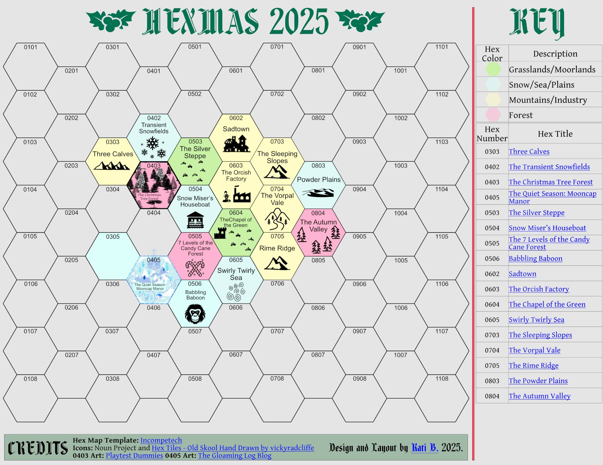
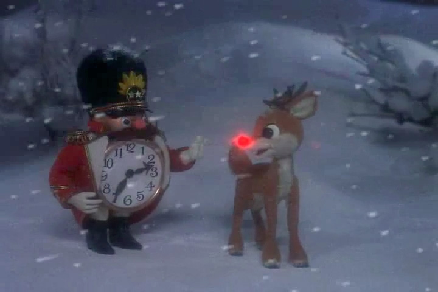

+++
title = "Hexmas: Four Rankin/Bass Themed Hexes"
date = 2025-12-05
path = "hexmas-2025"
description = "Four Rankin/Bass themed hexes for a Merry Hexmas. The hexes feature Lord of the Rings inspiration as per the Hobbit and Return of the King animations."

[extra]
image = "hexes_as_of_2025-12-05_and_mine_sml.jpg"

[taxonomies]
tags = ["Tabletop Roleplaying Games", "Hexmas", "OSR", "Blog Bandwagon"]
ttrpg = ["Hexmas"]
+++

Prismatic Wasteland has kicked off the [Blogwagon:
Hexmas](https://www.prismaticwasteland.com/blog/blogwagon-announcement-merry-hexmas)
where he calls for bloggers to create multiple hexes within a shared world
inspired by the thematic [Christmas cinematic universe of Rankin and Bass](https://en.wikipedia.org/wiki/Rankin/Bass_Animated_Entertainment),
such as the stop motion "Rudolph the Red Nose Reindeer" and the animated "Frosty the Snowman".
Rankin/Bass are also responsible for various other animations and stop motion films, including the original Lord of the Rings "Hobbit" and "Return of the King" animated films.

Given this, I provide four hexes to join the existing others, each of which I shall briefly detail here and then later on further refine and develop in their own blog post each following this one.

<!-- more -->

## The Current Hexmas Map

[Elmcat](https://elmc.at/) is kindly maintaining an ongoing list of the hex creators and their blog posts in this
[Google Sheet](https://docs.google.com/spreadsheets/d/15d2O5Ae-XSt3Uw9ae3tpjmo17NklSJ36SFAS75w2zJ4/edit?usp=sharing).
To preserve both the layout and our sanity,.
[Kati B.](https://bsky.app/profile/bakenshake.bsky.social) organized the hexes onto a grid with numbers, as seen below.
We are organizing the map and putting together new hexes in the [Prismatic Wasteland Discord](https://discord.gg/ETpeGbTdDP]).
Search for "Hexmas" within the Discord server and you'll find the thread.

I will update this blog post with the latest list and map.
I eventually want to make a sketch of the map as I originally released with this post, although for now that will have to wait given the constant updating.

The hexes for "The Island of Misfit Toys" and "King Kringle" currently do not have assigned neighbors or a hex number.
This structure is subject to change.
Prismatic Wasteland noted that you can "do whatever and we handle it at end" in terms of piecing the hexes all together.

What matters most is you have fun and create a hex!
If your hex is missing or you want to connect next to another hex, please join the Discord discussion, or otherwise reach out to us on social media.

|Hex #|Blog|Blog Post| Date   YY/MM/DD |
|---|---|---|---|
063| Magnolia Keep | [Orcish Toy Factory](https://magnoliakeep.blogspot.com/2025/11/blog-bandwagon-orcish-toy-factory.html) | 2025/11/03
504| To Be Resolved | [Snow Miser's Houseboat](https://tbr.bearblog.dev/merry-hexmas-blog-bandwagon-snow-misers-houseboat/) | 2025/11/03
064| Meadow of the Witch-Hares | [The Chapel of the Green](https://meadowofthewitch-hares.blogspot.com/2025/11/the-chapel-of-green-hexmas-blogwagon.html) | 2025/11/04
503| Fluorite Guillotine | [Broken Bronco on the Silver Steppe](https://www.fluoriteguillotine.com/blog/2025/11/08/blogwagon-broken-bronco-on-the-silver-steppe/) | 2025/11/08
**???**| Dieku Games | [King Kringle](https://diekugames.com/merry-hexmas/) | 2025/11/15
505| Peasantry | [The Seven Levels of the Candy Cane Forest](https://muto2525.substack.com/p/the-seven-levels-of-the-candy-cane) | 2025/11/22
506| Copper Shaman | [Babbling Baboon](https://coppershaman.com/merry-hexmas-babbling-baboon/) | 2025/12/03
405| The Gloaming Log | [The Quiet Season](https://thegloaminglog.blogspot.com/2025/12/the-quiet-season.html) | 2025/12/04
**???**| Komodo Games | [The Island of Misfit Toys](https://komodogames.substack.com/p/merry-hexmas-the-island-of-misfit) | 2025/11/09
042 | Periapt Games | [The Transient Snowfields](https://periaptgames.blogspot.com/2025/12/blogwagon-transient-snowfields.html) | 2025/12/05
073 | Errant Thinking | [The Sleeping Slopes](@/community/hexmas/sleeping_slopes/index.md) | 2025/12/06
074| Errant Thinking | [The Vorpal Vale](@/community/hexmas/vorpal_vale/index.md) | 2025/12/06
075| Errant Thinking | [The Rime Ridge](@/community/hexmas/rime_ridge/index.md) | 2025/12/06
803| Errant Thinking | [The Powder Plains](@/community/hexmas/powder_plains/index.md) | 2025/12/06
030| elsewhere, elsewhere | [Three Calves](https://elsewhere-elsewhere.neocities.org/posts/2025-12-07-23.-hexmas) | 2025/12/07
403| Playtest Dummies | [The Christmas Tree Forest](https://www.localgamestores.com/) | 2025/12/08 |
602| Ponder the Goose |[Sadtown](https://ponderthegoose.blogspot.com/2025/12/merry-hexmas-sadtown.html) | 2025/12/10
804| Tree Climber | [The Autumn Valley](https://tree-climber.blogspot.com/2025/12/merry-hexmas-autumn-valley.html) | 2025/12/11

### My current hex contributions

1. [**Sleeping Slopes**](@/community/hexmas/sleeping_slopes/index.md)
: A jagged mountain range that features a long dormant volcano with a frozen tower at its top. The hollowed out volcano that was once mined for its riches and resources is now abandoned. Perhaps due to the dark secrets within its depths?
2. [**Vorpal Vale**](@/community/hexmas/vorpal_vale/index.md): A valley between Sleeping Slopes to the north and Rime Ridge to the south. The fog often pours from the mountains into the valley which features a small river weaving between its slopes.
The Vorpal Vale is a common path from the Powder Plains to journey westward to the other side of the mountains opening up to the Chapel of the Green or the Orcish Toy Factory.
3. [**Rime Ridge**](@/community/hexmas/rime_ridge/index.md): A misty mountain range featuring a prominent mountain ridge and Blind Man's Bluff, which overlooks the "Swirly Twirly Sea of Gumdrops".
Many places are hidden among these rime covered mountains.
4. [**Powder Plains**](@/community/hexmas/powder_plains/index.md): A mostly peaceful flat snow field that features a few towns within this North Pole.

All of which are on the right hand side of the current map.
I have chosen to release four together so that I may mark my neighbors on the map as they pertain to the themes of my hexes and I wish to further refine their contents with their neighbors in mind.
This act of intertwining our creations is a very intriguing and fun aspect of this community blog event!

## Roaming Characters

I am introducing quite a few wandering characters that either hail from my hexes or are known to wander through them and even other hexes made by others, as befitting their ability and the existence of a path which enables someone of their ability to commit to such journeys.
Assume all non-automata travelers keep their livelihood in mind, while the automata will enter all types of territory.
Think of these characters as optional additional encounters, if so desired.
I also note rumors I leave up for others to do with what they will.

###  Sam the Snowman

From "[Rudolph the Red-Nosed Reindeer](https://christmas-specials.fandom.com/wiki/Sam_the_Snowman)", Sam is a snow elemental bard who travels from settlement to settlement sharing news and performing light deliveries.
Has the ability to travel with a whirlwind, like all snow elementals.
This helps avoid certain dangers.
Its hard to destroy a snowman that can reshape itself afterwards!

### Special Delivery Kluger

[A mailman](https://christmas-specials.fandom.com/wiki/S.D._Kluger) who often traverses between settlements delivering letters and by nature of his occupation is well versed in the ongoings of the settlements he's visited.
To be a mailman in the north pole is a dangerous endeavor.
How does he do it?

###  Clockwork horrors

**Clockwork horrors** tirelessly hunt across all of the North Pole for Happy the Baby New Year to be returned to the current Father Time, of "The Dark Year" back at his Palace of Time.
These twisted clocks tick-tock on the dot. They are precise, exact automata.

### Aeon the Terrible

[Aeon](https://christmas-specials.fandom.com/wiki/Aeon_the_Terrible) from "Rudolph's Shiny New Year"
- Tends to fly and hunt around my four hexes
- Secrets:
    - He does not hunt for Happy the Baby New Year.
    - His eon is not at risk this new years or even soon.

###  Ruprecht Belznickle, the starry-eyed redcap

I decided to further develop an original character of mine from last year, Belznickle.

- Ruprecht Belznickle is a [hulderálfar](@/community/santicorn/the-elves-revolt.md#the-hulderalfar), the original Christmas Elves of yore.
    - While he is indeed short, he is notably much more stocky and muscular than the typical Christmas elf.
        - If there were ever a short king, you're confident you're currently in his presence.
        - Incredibly confident and cold aura
    - Their long elf ears go straight out to the sides
        - He has golden bell ear rings at the tips of his ears.
    - Unique to him, his eyes are like star fields on the pitch black of space.
- He is a lumberjack and rangifer wrangler (caribou herder)
    - Specifically he traverses and trims Yggdrasil by traveling by the Bifrost, the aurora Borealis, or through his elven ways of simply disappearing from sight.
    - The disappearing from sight is him walking in a dimension unrecognized by those Earth born.
    - He is one of the few who provide the important Yggdrasil wood that allows Santa Claus' sleigh to fly in the night sky.  The sleigh made from Yggdrasil may traverse its branches, while the typical Earth born reindeer and other folk cannot.
    - He also sells Yule Logs, logs cut from Yggdrasil that bear sacred yuletide runes and carvings.
- Equipment
    - He carries a large wood cutting axe with a stark black axe head as dark as the void.
    - Wears a [redcap's red cap](https://en.wikipedia.org/wiki/Redcap), although he's not acted like a redcap for a long, long time.
        - Still has the same dagger on his belt.
    - He wears a thick brown fur coat
    - On his belt, besides his redcap dagger:
        - a whip
        - bells
    - In a sack on his back he carries trimmings of Yggdrasil that could serve as switches as well as a sack of coal.
        - He often sells coal to the different towns.
- Beliefs
    - If he hears of the Tiny Bronco in the Silver Steppe he'll remark, "A beast born of the earth will return to her.  Every time."
    - On anyone saying he's immortal, "Aye. Many call me immortal."
    - On the Misers, "Unless they're paying for my services, I pay them no mind."
    - On the monsters and dark happenings, "Aye. It's dangerous out there. Keep your wits about ye."
    - Advocates for hard work and a job well done.
        - "A job worth doing is worth doing well."
- Spiller of tea: As he gets around, he tends to know things about the world.

## Rumored Characters

- **"The Dark Year"**
    - This year was a brutally dark one, and they are dissatisfied with that.
    - They feel cheated and seek to prolong their year or otherwise seek more time of their own to change its course.
    - They are said to be hunting for the missing baby New Year.
    - Theme: Father Time had a scythe in "Shiny New Year", it is just begging for dark grim reaper themes!
- **The Tooth Fairy**
    - Dark rumors spread of a tooth fairy that forcibly extracts its victim's teeth from their jaw.
    - Dentists say its because they didn't brush and floss their teeth twice a day!

## Conclusion

This Hexmas community event is quite some fun!
Feel free to join in on the fun, and check out my hexes:

1. [Sleeping Slopes](@/community/hexmas/sleeping_slopes/index.md)
2. [Vorpal Vale](@/community/hexmas/vorpal_vale/index.md)
3. [Rime Ridge](@/community/hexmas/rime_ridge/index.md)
4. [Powder Plains](@/community/hexmas/powder_plains/index.md)
