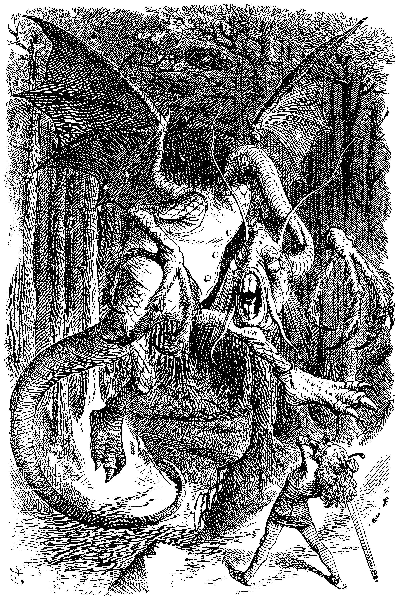
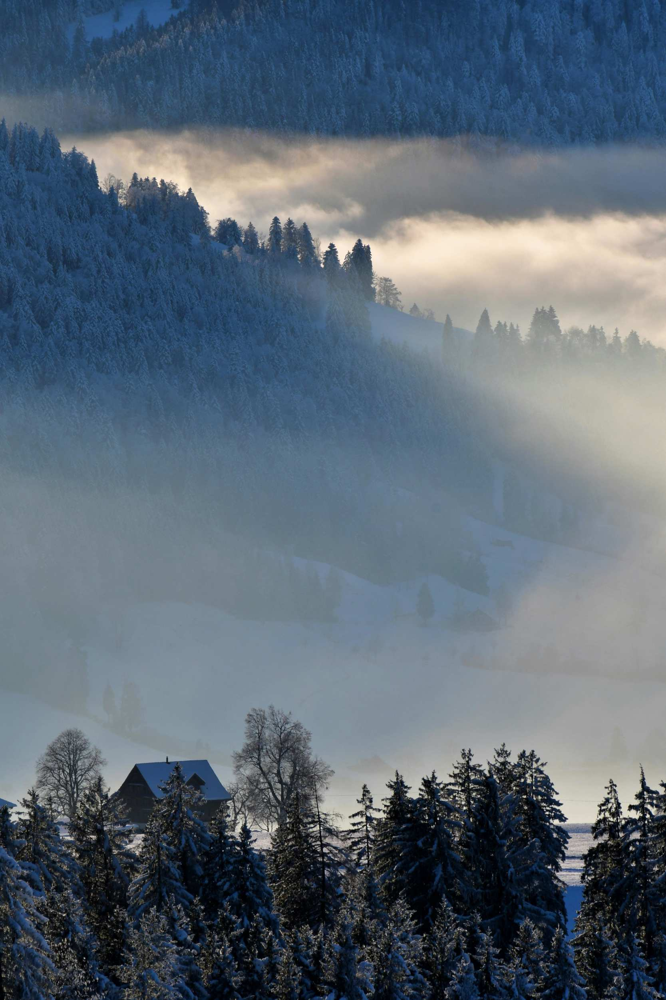

+++
title = "The Vorpal Vale"
date = 2025-12-06
path = "vorpal-vale"
description = "A Rankin/Bass themed location for a Merry Hexmas. A mysterious fog covered valley with a winding river between the various hills."

[extra]

[taxonomies]
tags = ["Tabletop Roleplaying Games", "Hexmas", "OSR", "Blog Bandwagon"]
ttrpg = ["Hexmas"]
+++

A Rankin/Bass themed location for a [Merry Hexmas](@/community/hexmas/hexmas_2025/index.md). A mysterious fog covered valley with a winding river between the various hills.
The headless Chevalier Vert roams the vale from dusk to dawn in search of his lost head.
In the mornign he turns to mist and the Jabberwock takes his place, albeit hunting for other's heads to mash and nash and misplace.

<!-- more -->

## Terrain and Biome

A steep valley between the mountains in the north and south featuring its own bumpy hills with a winding river that traverses between those hills.
Various lakes and streams form from the melting mountain ice that gathers into
the vale's primary winding river, which flows from the northeastern Powder Plains into the west towards the Swirly Twirly Sea of Gumdrops.
The clouds that accumulate from the ocean against Rime Ridge results in the heavy rains over The Green Chapel and its fields, and also in a thick fog that is nearly always present in the Vorpal Vale.
People get lost in this misty vale and many mysteries dwell within.

### Weather

1d10 : if 10, then there is **no** fog, otherwise there is fog.

If it is foggy, then 1d20 for snow: 1 to 10: no snow, 11 to 19: snow, 20. blizzard.
If it snows or blizzards while there is a fog, this results in a freezing fog where the fog will freeze to surfaces forming [rime ice](https://en.wikipedia.org/wiki/Rime_ice).
If it is snowing, then low winds form soft rime ice.
If a blizzard occurs, then high winds form hard rime ice.
Getting caught in a blizzard may require finding or making shelter, otherwise it slows travel and tests ones survival.

Cannot get lost in the fog when you have someone like Rudolph the Red-Nosed Reindeer guiding your way!

## Rumors of the Vorpal Vale

The road from the Powder Plains to here has a battered wooden sign that reads:

>Danger! Beware the Vorpal Vale's mists! Keep your head on straight!

This road follows the banks of the winding river through the vale.

### The Chevalier Vert

A headless knight in green prowls the vale at night riding atop a large [boreal woodland caribou](https://en.wikipedia.org/wiki/Boreal_woodland_caribou).
They call him **Chevalier Vert**.
It is said he hunts in a frenzy for his missing head and helm all through the night.
Yet once dawn strikes, he disappears into a mist.

Some say there is a *sacred scroll* in the *Chapel of the Green* that can be used to control him.
Others say if his head were to be returned to him, his wild spirit would finally know peace.

He is said to carry a vorpal sword that could cut clean the head of the great Jabberwock in a single snicker-snack!
Too bad his gear along with himself all turn to mist at dawn!

Chevvalier Vert was known to wear a magnificient antlered helm.
However, he lost it prior to losing his head in the Vorpal Vale.
There are rumors of a [Yule Barbarian](https://playtestdummies.substack.com/p/merry-hexmas-the-christmas-tree-forest), more westward than north of the vale, who possesses such an antlered helm.
They say to "seek a henge of a dozen".

#### Upon Return of his Head

The Chevalier Vert will regain his sanity and cease his frenzy upon the return of his head.
He is now able to escort the party with his faithful mount during the evening.
However, until he regains his antlered helm, he cannot aid the party during the day.

He'll tell the tale of how he lost his head here due to not wearing his great antlered helm.
He lost his helm in an epic fight against a demonic wind mill.
He swears it was a legendary foe.

Once he is whole again with both his head and helm, he can reattach his helmed head and be free from his misty bonds to the Vorpal Vale.

### The Jabberwock

The Jabberwock is known to visit the Vorpal Vale during the day to prey upon those lost.
This mysterious beast is huge and is known to mash and nash and steal people's heads and misplace them.
The jabberwock enters and leaves this vale through mirror like still waters that pool among the many hills in the vale.
It is said that those mirror like still waters can serve as a portal to a whole new land, a wonderous land.

## Random Encounters

The Vorpal Vale is a common path of travel in part due to it not being as long, laborious, and dangerous (relatively) as travelling through the adjacent mountains.
You'll often meet other travelers on the road.

### The Curse of the Vorpal Vale

There is a Curse of the Vorpal Vale which accumulates upon travellers.
Treat the curse as a counter for the adventurers that starts at zero and increments when specified in the random encounters below.
If the Vorpal Vale Curse is less than four *after* incrementing, then nothing happens.
If that is disappointing, then choose an encounter or roll again.
On the fourth count, reset the counter to zero and *all* of the following occurs:
- Fog pours over Rime Ridge into the vale.
- Vorpal Veil occurs.
- Encounter 3x Daytime or Nighttime Roamers given the time of day.
    - If night and not yet encountered, encounter the **Chevalier Vert** as one of these encountered roamers.

### Daytime
1. Increment the Vorpal Vale Curse, which starts at zero.
2. **Vorpal Veil**: Keep your head on straight!
    - If it is *not* foggy, increment the Vorpal Vale Curse.
        - If he is not yet encountered: Encounter
        [**Ruprecht Belznickle**](@/community/hexmas/hexmas_2025/index.md#ruprecht-belznickle-the-starry-eyed-redcap)
        herding his caribou.
    - If it is already foggy in the Vorpal Vale, roll 1d6 for a new exit direction from this hex, starting with 1 at North, 2 at Northeast, and so on clockwise.
        - If he is not yet encountered: Encounter **Sir Tento Three**, the Lost.
        Lost in the mists of the Vorpal Vale, Sir Tento searches for "Happy" New Year, albeit not for "The Dark Year"'s purposes.
3. **Bassians**: Whether hunting or one of their still water homes is happened upon by the adventurers.
4. [**The Jabberwock**](https://en.wikipedia.org/wiki/Jabberwocky), but only roams during the daytime
    - If unavailable, treat as #6 for Daytime Roamers.
5. **Aeon the Terrible**: Frequents the valley for a meal. Loves a good Bassian or Reindeer.
    - If unavailable, treat as #6 for Daytime Roamers.
6. Daytime Roamers:
    - Who?: Roll for possible people to encounter.
        1. [**Ruprecht Belznickle**](@/community/hexmas/hexmas_2025/index.md#ruprecht-belznickle-the-starry-eyed-redcap)
        2. **Sir Tento Three**: Lost if not yet encountered here, otherwise 50/50 lost or not.
        3. **Yukon Cornelius** and his sled dogs.
        4. **Miser Minions**: Roll a 1d6
            - Result + 2 is the number of minions.
            - If even, Snow Miser minions, if odd Heat Miser minions
            - If a 5, then they escort Heat Miser.
            - If a 6, then they escort Snow Miser.
        5. **Sam the Snowman**
        6. **S. D. Kluger**
        7. wild animals:
            1. 2d6 wild reindeer
            2. 2d6 wild woolly sheep
        8. Roaming Hostiles:
            1. 1d4 **Keh Nights**
            2. 1d4 **Clockwork horrors**
            3. 2d4 **Gorcs**
            4. 2d4 **Ramkins**
    - What?: Roll on this encounter table again, If #1 or #2, do not increment the Vorpal Vale Curse. If #1, the "Who" in question are resting, whether camping or a brief respite.

### Nighttime

1. Increment the Vorpal Vale Curse, which starts at zero.
2. **Vorpal Veil**: Keep your head on straight!
    - If it is *not* foggy, increment the Vorpal Vale Curse.
        - If he is not yet encountered: Encounter **Ruprecht Belznickle** herding his caribou.
    - If it is already foggy in the Vorpal Vale, roll 1d6 for a new exit direction from this hex, starting with 1 at North, 2 at Northeast, and so on clockwise.
        - If he is not yet encountered: Encounter **Sir Tento Three**, the Lost.
        Lost in the mists of the Vorpal Vale, Sir Tento searches for "Happy" New Year, albeit not for "The Dark Year"'s purposes.
        - If not yet encountered, encounter the **Chevalier Vert**.
3. An Aurora Borealis runs across the night sky.
    - Same results as #2 **Vorpal Veil**.
    - If it is foggy, someone may attempt to use the cover of the fog to mask their travel to and from the branches of Yggdrasil within this vale.
4.  **The Headless Chevalier Vert**.
    - If unavailable, treat as #6 for Nighttime Roamers.
5. 1d6 **Headless Skeletons**:  Wandering in search of their lost heads.
6. Nighttime Roamers:
    - Who?: Roll for possible people to encounter.
        1. [**Ruprecht Belznickle**](@/community/hexmas/hexmas_2025/index.md#ruprecht-belznickle-the-starry-eyed-redcap)
        2. **Sir Tento Three**: Lost if not yet encountered here, otherwise 50/50 lost or not.
        3. **Yukon Cornelius** and his sled dogs.
        4. **Miser Minions**: Roll a 1d6
            - If even, Snow Miser minions, if odd Heat Miser minions
            - If a 5, then they escort Heat Miser.
            - If a 6, then they escort Snow Miser.
            - Result + 2 is the number of minions, in addition to the possible master Miser.
        8. Roaming Hostiles:
            1. 1d4 **Keh Nights**
            2. 1d4 **Clockwork horrors**
            3. 2d4 wolves
            5. 1d6 **Anglers**. Like the Bassians, but with an anglerfish head instead of the head of a bass.
    - What?: Roll on this encounter table again, If #1, #2, or #3, do not increment the Vorpal Vale Curse. If #1, the "Who" in question are resting, whether camping or a brief respite.

## Locations within the Vorpal Vale

### Misty still waters
- Some ponds are so still their reflections are like mirrors, even when frozen.
- From these mirror like pools the Jabberwock is said to emerge during the day and retreat during the night.
- Bassians (pronounced as the Bass fish) lurk in these waters.
- Only around these still waters will you encounter **2d4 Cuttops**, which are small hunched over gremlins with webbed feat and the top of their head cut off holding within it no brains, but water from
    - They like to sit still.  They meditate, or observe.
    - They attack those who disturb their still waters.
    - Though sometimes they just sit without eating for a while because none of them want to distrub the waters with their fishing.

#### The Pool of the Chevalier

- Somewhere in the Vorpal Vale is the Chevalier Vert's head.
   - If the party attempts to search for it they have chance of finding the one of many misty still waters in which the head is submerged.
   - A 1 on the following dice results in finiding the correct location, where the next one die smaller is used for every attempt until 1d1.
   - 1d20, 1d12, 1d10, 1d8, 1d6, 1d4, 1d2, 1d1
   - Each time the adventurers get lost due to the **Vorpal Veil**, the die size decreases improving their odds. Perhaps even the spirits of the Vale pity the poor Chevalier Vert?

Cuttops represented by
<a href="https://denungeherrholm.smugmug.com/Other-Arts/Daily-Ink-Monsters/i-CF7rR6k/A">
"Shinju, the Greedy Kappa" by Kim Holm, CC-BY 4.0.
</a>

### A Snow Covered Cabin

There are various cabins of different sizes within the vale, although they are often deserted.
Sometimes, you'll find them welcoming as shelter from the cold.
Othertimes, you'll find you weren't the only one seeking shelter!

Inside some of these cabins or around them, you'll find the remanants of those who last stayed.
Some of them include their own gardens, though the frost and cold can be quite harsh to vegetation.
Among these gardens or even inside the cabin you'll find some of the produce frozen.
These include pumpkins, turnips, and rutabaga.

Sometimes, you find these vegetables carved with faces and hollowed out to serve as lanterns.
It is said that these lanterns can resist the Vorpal Veil, letting someone journey through the vale without losing their way or their head.
A carved **jack-o-lantern** lasts only for a few days and has *only one use* as a lantern in the Vorpal Vale to resist getting lost.

If the headless Chevalier Vert pursues you, it is said that offering it this jack-o-lantern as a substitute head will appease the spirit for one night.
It will at least accept the gift, adorn its new head, smile, and leave you in peace for the evening.

## Neighboring Hexes

|Direction|Adjacent Hex Location|
|---|---|
| North | [The Sleeping Slopes](@/community/hexmas/sleeping_slopes/index.md) |
| Northeast | [The Powder Plains](@/community/hexmas/powder_plains/index.md) |
| Northwest | [The Orc Toy Factory](https://magnoliakeep.blogspot.com/2025/11/blog-bandwagon-orcish-toy-factory.html) |
| Southeast | [The Autumn Valley](https://tree-climber.blogspot.com/2025/12/merry-hexmas-autumn-valley.html) |
| Southwest | [The Chapel of the Green](https://meadowofthewitch-hares.blogspot.com/2025/11/the-chapel-of-green-hexmas-blogwagon.html) |
| South | [Rime Ridge](@/community/hexmas/rime_ridge/index.md) |
