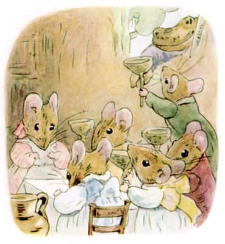
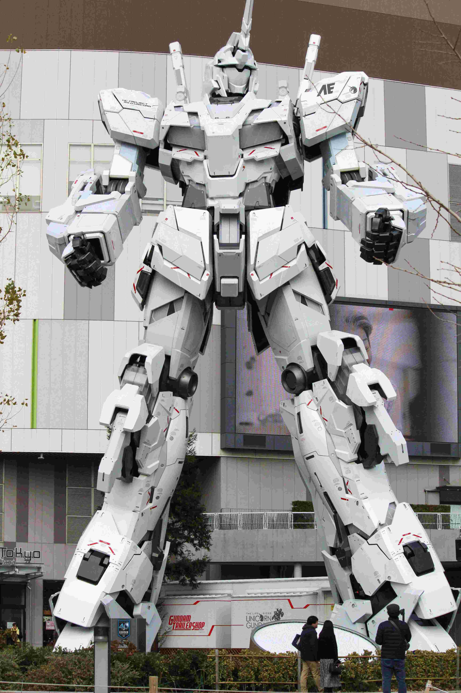
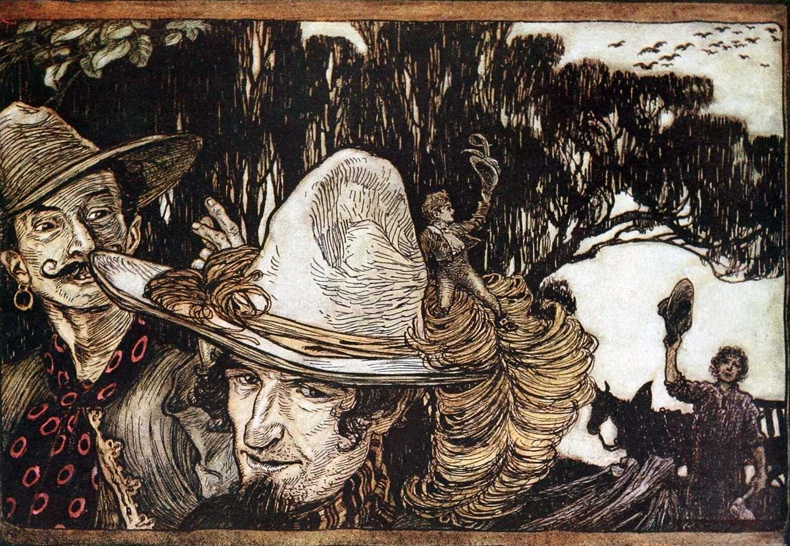
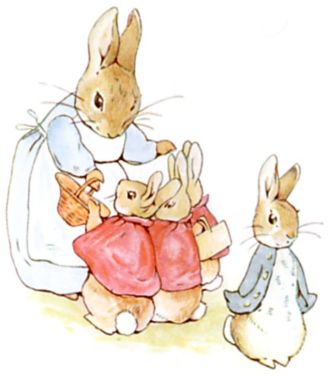
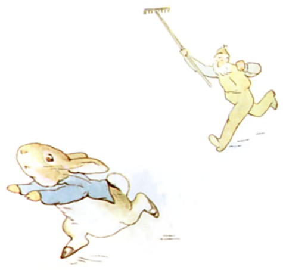

+++
title = "Amidst Tiny Epics"
date = 2026-03-15
path = "amidst-tiny-epics"
description = "An update on recent contributions to the Tiny Epic March RPG Blog Carnival and a brief discussion of ideas."

[extra]
image = "tittle_mouse_honey-dew.jpg"

[taxonomies]
tags = ["Tabletop Roleplaying Games", "RPG Blog Carnival", "Blog Bandwagon", "Tiny Epics"]
ttrpg = ["RPG Blog Carnival", "Blog Bandwagon"]
+++

We're midway through March and already people have shared their creations for this month's RPG Blog Carnival on the theme "[Tiny Epics: Small Souls in a Big World!](@/community/rpg-blog-carnival/tiny_epics/index.md)".
This community event is ongoing, and I wanted to discuss some people's published content as well as some discussion that occurred around the internet.
Share your creations with me early, and I'll do weekend updates in addition to the final roundup on March 31st.

<!-- more -->

An illustration from Beatrix Potter's
<a href="https://www.gutenberg.org/ebooks/17089" target="_blank">The Tale of Mrs. Tittlemouse</a>.
 

## On the World Making You Feel Small

Early on in the first week of this event, others shared their perspective on the theme about emphasizing the feeling of being small as humans in an immense world or when in the presence of enormous beings.
I personally have been focused on anthropomorphised creatures smaller than humans.
This discussion helped me realize the intrigue of *feeling* small when the rest of the world is big.
Velocitree shared some existing works with me that emphasize this perspective, which I had not known about.
So I wanted to share them with you.

- Luke Rejec's [Purple Worm 2012 One Page Dungeon](https://friendorfoe.com/d/One%20Page%20Dungeon/1PDC%202012/Luka%20Rejec%20%E2%80%93%20Deep%20in%20the%20Purple%20Worm.pdf)
- Gus L.'s 2015 "[Comes the Mountain](https://alldeadgenerations.blogspot.com/p/pdf-adventure-archives.html)" 4 page adventure idea, among others.
    - Another here pertaining to size is the "Lone Colossus of the Akolouthos Sink"
- [Skerple's Roving Wheel One Page Dungeon](https://coinsandscrolls.blogspot.com/2018/08/osr-one-page-dungeon-roving-wheel.html)
- A science fiction novel "[Kaiju Preservation Society](https://en.wikipedia.org/wiki/The_Kaiju_Preservation_Society)"

From towering trees, to mechs & kaiju, to imposing structures, we feel our size.

## List of Little Folk Stories and Media

Late on the 8th, I shared my current [list of stories and media featuring little folk](@/soul_system/little_folk_media/index.md).
I wanted to share this list as it helps remind us of some of the existing works within this genre.
Perhaps, some that we once met before, but have since drifted from our memories.
And, perhaps even more intriguing, some new ones, that we have yet to be acquainted with and can get to know with avid curiosity!
Many on this list are new acquaintances of mine, and ones I have added to my "to enjoy" list in the future.

There was some discussion about what are the boundaries for the genre of little folk, and I was reminded again of my biases.
I made the list with my focus on small creatures relative to humans' physical size.
This misses out on some stories where you're among giants, although I did include at least one, Kabu no Isaki, where the characters are normal humans in a x10 sized world.
I'm curious about Kabu no Isaki as its new to me, and I may look into the future!
I also mixed in a lot of anthropomorphised creatures in that list, but I've certainly found some stories that were simply animals scaled to human size, acting as humans, in a world and society familiar to us as humans.
I tried to remove those as the theme of being or feeling small was not as prominent.
If you notice any I missed, please let me know!
I should probably make a separate list of stories featuring anthropomorphised creatures.

## Playing the Borrowkin in D&D 5e

On March 10, Vulcan Stev shared a post on creating [the Borrowkin as a playable D&D 5e race](https://vulcanstev.blog/2026/03/10/tiny-epics-an-rpg-blog-carnival-the-borrowkins/).
Inspired by Mary Norton's "The Borrowers", Stev goes into great detail about these tiny creatures from the hearth to the hedge and beyond.
Stev goes directions I did not expect, such as these Borrowkin being recognized by dragons!
I can tell some thought was put into this, and
I appreciate when people take a concept and really flesh it out or add some unexpected twists.
If you've been curious about playing a tiny creature in D&D 5e, especially like the Borrowers, Stev's got you covered!

Arthur Rackham's illustration of
<a href="https://www.oldbookillustrations.com/illustrations/tom-good-bye/" target="_blank">Tom Thumb</a>.
 A Far-Threaded on a journey with adventurers.

## A Wanderhome Setting

On March 12, K. Chase Tramel published a post on a charming [custom Wanderhome setting](https://www.cozyquestlog.com/small-souls-in-a-big-world/).
This post focuses on a coming of age cultural experience for animal folk children called the "Walkabout".
When a child is deemed old enough, they go on a journey to experience the world.
The Walkabout naturally fits Wanderhome's premise of the player characters travelling and finding themselves.
I think this serves as an interesting way to expand the repertoire of young characters to explore beyond the official "Ragamuffin" playbook.
From this, I can see the players experience a coming of age story filled with child-like wonder and whimsy while gently posing tough questions to the young journeyer;
questions and challenges of the dreams we have as children when faced with the reality of the world.
I can see deep reflection for both the characters and the players resulting from this setting.
Tramel goes into more detail and I recommend you give the post a read!

Readying for their Walkabout.

A Walkabout gone wrong!

Illustrations from Beatrix Potter's
<a href="https://www.gutenberg.org/ebooks/14838
" target="_blank">The Tale of Peter Rabbit</a>.

## The March of the Tiny Epics Continues!

If you have anything you'd be interested in writing into a blog post and sharing, we'd love to read it!
If you want some ideas, here is a [list from the original post](@/community/rpg-blog-carnival/tiny_epics/index.md), however feel free to make whatever your heart desires!
Works in progress, short pieces, or multiple posts are all more than welcome.
