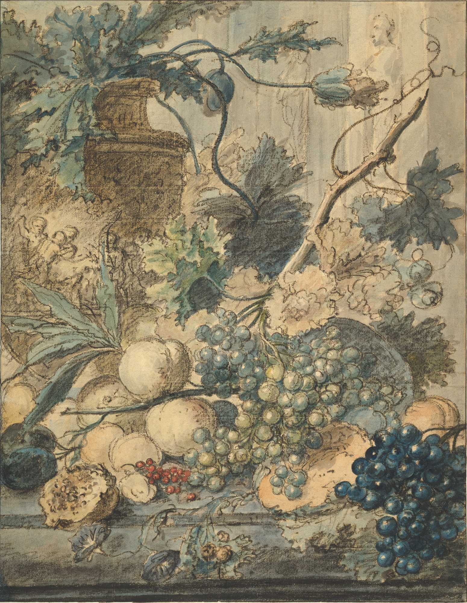

+++
title = "Inspiring Real World Feasts and Festivals"
date = 2025-11-30
path = "feasts-and-festivals"
description = "I've decided to join in the festivities of this November's RPG Blog Carnival. This month's theme is \"Feasts and Festivals\" in tabletop role-playing games as hosted by 'of Dice and Dragons'. I will discuss some real world festivals and mythology as sources of inspiration for one of my custom settings, Ophelos."

[extra]
image = "still-life_fruits_metmuseum_DP820041_slim.jpg"

[taxonomies]
tags = ["Tabletop Roleplaying Games", "RPG Blog Carnival", "Feasts", "Festivals", "Seasons"]
+++

I've decided to join in the festivities of this November's RPG Blog Carnival.
This month's theme is "Feasts and Festivals" in tabletop role-playing games as hosted by [of Dice and Dragons](https://ofdiceanddragons.com/feasts-and-festivals-in-your-ttrpg-campaigns-rpg-blog-carnival/).

I will discuss some real world festivals and mythology as sources of inspiration for one of my custom settings, Ophelos.

<!-- more -->

## What is Ophelos?

Ophelos is an island ripe with culture and folklore inspired in by Hellenistic folklore combined with the mysticism of Tarot and the wonder of fae and spirits.
I particularly enjoy folklore and how one can find connections between their concepts and stories even across cultures.
A particular inspiration from Hellenistic folklore is the intermingling of beliefs and localized spirits with their interconnecting domains.
In Ophelos, these spirits do not tend to be all powerful deities.
If any such deities are at play, then they are believed to more often act through the local spirits and their worshippers.

With that said, there are five distinct deities within the culture of Ophelos.
One for each of the four seasons and one for change.

1. Spring:  God of Creation
2. Summer:  Goddess of Growth
3. Autumn:  Goddess of Harvest
4. Winter:  God of Time
5. Liminal: Goddess of Change

Let's seek inspiration for the festivals of change that occur between seasons,
in which Lady Change plays a pivotal role.

## The Festivals of a Change in Seasons

These festivals occur at the turning point of the seasons, typically the half way points between the solstices and the equinoxes.

1. **winter -> spring**
    - mud season
    - beginning of spring
    - birth or rebirth
2. **spring -> summer**
    - first day of summer
    - loss of innocence
3. **summer -> fall**
    - beginning of harvest season
    - To begin harvesting that which was grown. To reap one's rewards or consequences
4. **fall -> winter**
    - stick season
    - first frost
    - end of harvest season, entering winter
    - "assembly of the living and the dead"
    - Entropy: Nearing to the point of stillness

A nice thing about seasons on Earth is that it is a shared experience across cultural and natural boundaries.
This shared experience results in parallels between folklore associated with the seasons.

### The Greek Goddess Demeter & the Seasons

The messy story involves Demeter, Zeus, their daughter Persephone, and Hades.
This is the famous "Abduction of Persephone" by Hades, which the 2020 video game "Hades" explores in its plot.
In brief, Hades is smitten with Persephone wishing to make her his wife.
After receiving permission from Zeus and help from Gaia, the earth cracks and Hades emerges on his chariot and abducts Persephone unwillingly into the Underworld (Dude, why?).

Demeter is distraught and searches the world for her daughter.
In her distress, she causes an unending famine that plagues the mortals (Oops).
Zeus eventually mediates between Demeter and Hades where the deal is Persephone spends half the year with Demeter and the other half with Hades in the underworld (Dunno if this counts as fixing the mess you enabled).
This results in the seasons of spring and summer when Persephone is with Demeter, and autumn and winter when she's with Hades.

Or at least that is one perspective.
The famine caused by Demeter could also be a drought at the height of summer, which better ties to her as a goddess of harvest and agriculture.

**Overly Sarcastic Productions** cover this mythology in a [video](https://www.youtube.com/watch?v=Ac5ksZTvZN8). I recommend queueing it up for a watch.

#### Related Greek Festivals or Holidays

Chloe is a feminine Greek name meaning "blooming", "fertility", "fresh and green foliage", or "shoots of plants in spring".
It was one of the many epithets of Demeter [[1]].
The joyful festival of Chloeia celebrated the beginning of the spring and was held in Athens to honor Demeter Chloe ("the Green") and her bringing new vegetation.
The celebrations included a goat sacrifice and merrymaking.

### Gaelic Festivals for the Change in Seasons

There are some interesting parallels between these festivities and Ancient Greek practices
beyond my expectations for the shared seasonal experience.
Some of those include the parts of the stories of their deities around the seasons.

1. **winter -> spring**: [Imbolc](https://en.wikipedia.org/wiki/Imbolc)
    - 1st of February marks the beginning of spring.
        - and lambing season, with fresh sheep milk and new sheep,
        which is very important to the livelihood of herders and food production.
    - Etymology: Unclear, but one explanation is that it means "in the belly" in Old Irish (*i mbolc*), which relates it to new birth.
    - In Christianity, a feast day for Ireland's patroness saint, Saint Brigid.
    - ritual cleansing through washing of the body as well as spring cleaning of the abode
    - traditionally associated with weather lore to see if serpents, badgers, or other hibernating animals first exit their dens.
    - special meal typically grains, bread, dumplings, and potatoes.
2. **spring -> summer**: [Beltane](https://en.wikipedia.org/wiki/Beltane)
    - 1st of May marks the beginning of summer and the growing season.
    - Etymology: proposed to derive from proto-Celtic \*belo-te(p)niâ to mean "bright fire"
        - possibly connected to a god, Bel
    - Rituals to protect cattle, people, crops, and encourage growth
        - lighting of torches in name of a god Bel and herding the cattle between them
    - ritual bonfires kept burning and kindled frequently with animal sacrifices
        - Spreading of the ashes to spread the blessing of Bel
        - fire taken from the bonfire as torches for protection
            - "Doorways" to the [Otherworld][2] opened at this time
        - The fire possibly represents the sun to provide growth and burn harmful influences
    - Food cooked over the bonfire
        - featured lamb, caudle from eggs, butter, oatmeal, and milk, and oatmeal cake called "Beltane bannock".
3. **summer -> fall**: [Lughnasadh](https://en.wikipedia.org/wiki/Lughnasadh)
    - 1st of August marks the beginning of the harvest season.
    - Etymology: "an assembly for Lugh"
        - Named after god Lugh
    - In Irish mythology, believed to have been founded by the god Lugh as a funeral feast and athletic competition of funeral games to honor the death of an earth goddess.
        - The woman tends to parallel the Greek tale of Persephone where a woman is unwillingly carried off and dies from some cause of that.
        - Another perspective is it is the mourning or wake for the end of summer.
    - In Middle Ages, involved athletic contests, horse racing, feasting, matchmaking, and trading
        - included offering the first fruits, first corn, and a bull as sacrifice
        - athletic contests: similar to Ancient Olympic Games
        - matchmaking: "Trial marriages" that lasted a year would be initiated
    - A tradition of being held atop hills and mountains and involved the climbing them
    - Pilgrimage to holy wells, specifically [clootie wells](https://en.wikipedia.org/wiki/Clootie_well)
        - Custom shared with Imbolc and Beltane
4. **fall -> winter**: [Samhain](https://en.wikipedia.org/wiki/Samhain)
    - 1st of November marks the end of the harvest season and beginning of winter.
    - Etymology: proposed to derive from proto-Celtic *\*samoni* for "reunion, assembly". One proposes "assembly of the living and the dead"
    - One of the early harvest festivals featuring feasts
    - Ritual bonfires
    - Divination
    - Spirits and souls: "Doorways" to the [Otherworld][2] opened at this time
    - Costumed folk plays (mummers) and "Guising" much like that of modern Halloween trick-or-treat tradition.
    - Turnip lanterns were used by the guisers and are precursors to the jack-o'-lantern.

## Conclusion

Those are some interesting real world festivals and mythology to inspire your own fantasy festivals.
These focus on the in-between times, the season's appropriate solstice or equinox are also ripe for holidays.
I'm also thinking about the lunar cycle and associated holidays for the lunatics!
I'll be unveiling the setting of Ophelos over time, or at least sharing some progress and thoughts along the way.
Make sure to check out what out what others have written for this [RPG Blog Carnival](https://ofdiceanddragons.com/feasts-and-festivals-in-your-ttrpg-campaigns-rpg-blog-carnival/)!

___

## References

1. Liddell, Henry George; Scott, Robert; Jones, Henry Stuart; McKenzie, Roderick. 1940.  "A Greek-English Lexicon". Ed: 9. Vol: I. Oxford: Clarendon Press. [archive.org][1]

[1]: https://archive.org/details/b31364949_0001
[2]: https://en.wikipedia.org/wiki/Celtic_Otherworld
