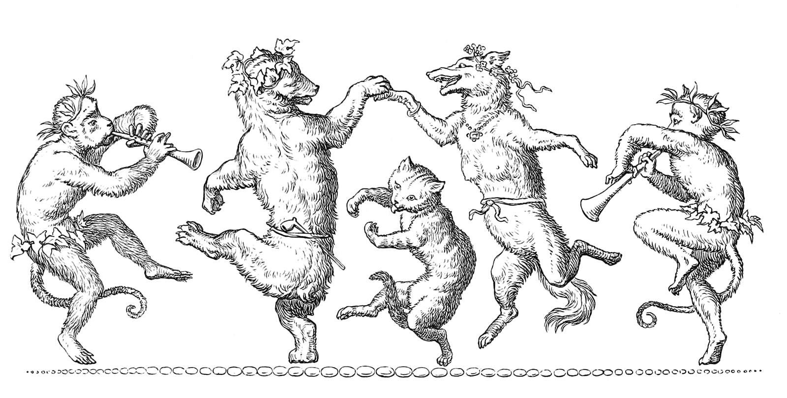
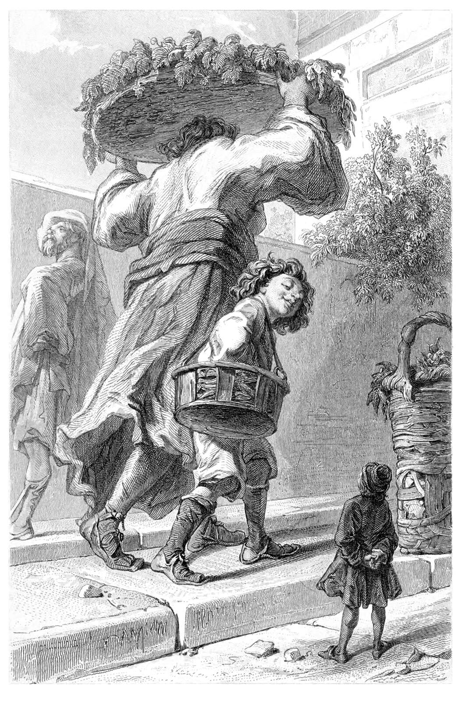

+++
title = "March of Tiny Epics"
date = 2026-03-23
path = "march-of-tiny-epics"
description = "More join the March of Tiny Epics for this RPG Blog Carnival!"

[extra]
image = "canto-seven-1600.jpg"

[taxonomies]
tags = ["Tabletop Roleplaying Games", "RPG Blog Carnival", "Blog Bandwagon", "Tiny Epics"]
ttrpg = ["RPG Blog Carnival", "Blog Bandwagon"]
+++

More have joined in on the March of "[Tiny Epics!](@/community/rpg-blog-carnival/tiny_epics/index.md)" for the RPG Blog Carnival.
This community event is ongoing, and I wanted to discuss some people's shared creations!
Share your creations with me early, and I'll do weekend updates in addition to the final roundup on March 31st.

<!-- more -->

An illustration by Wilhelm von Kaulbach for Johan Wolfgang von Goethe's
<a href="https://www.oldbookillustrations.com/illustrations/canto-seven/" target="_blank">Reynard the Fox</a>.

## "Underlog", a Pocket Setting

Empedocles at Elemental Reductions wrote [Underlog, A Pocket Setting](https://elementalreductions.blogspot.com/2026/03/underlog-pocket-setting.html) on March 18th, which references his prior made Invertebrate Ancestries.
His setting features creatures fifty times larger than those of our world with intelligent invertebrates being the primary folk the player characters encounter.
Empedocles has thought out the resources and common uses of materials in this world, where chitin is more abundant than metal.
I enjoy the mechanics of decreasing a damage die size every time a brittle centipede mandible blade further breaks.
That makes a nice degradation of effectiveness for the item!
Snail shell armor is also quite inspiring and something I'll personally think more about in the future.
My friend and I once jested about small critters using [Durian rinds](https://en.wikipedia.org/wiki/Durian) as a type of armor, so snail shells is another welcome addition!
I also appreciated Empedocles' thoughts on his project.
Seeing a designer's thoughts can be quite insightful.
If you're interested in a setting where bugs are as big s you, then check out his setting, ancestries, and caterpillar rampage encounter on [itch](https://empedocles.itch.io/)!

## Rescaling Encounter Maps

Xaosseed of Seed of Worlds wrote about [Rescaling Encounter Maps](https://seedofworlds.blogspot.com/2026/03/rescaling-encounter-maps-for-tiny-epics.html) on March 21st.
I see Xaosseed is as inspired as I am in taking existing maps and exploring them when at a different scale.
This can be such a fun thought experiment and helps you take on a whole different perspective of an environment.
This idea coupled with normal sized creatures, or even the typical big bad, being problems the players must solve when tiny is very appealing from both a game design perspective and a player problem solving perspective.
Xaosseed explores Castle Balronco from their Southern Reaches campaign.
I enjoy people's fresh ideas, and the idea of exploring a map scaled up as the submerged ruins to be explored by a submersible is delightfully inspired!
Also, heck yes to taking woodworm tunnels as map design inspiration.

## "Tiny Tales", a Campaign Retrospective

On March 21st, Christopher Kurts of Playtest Dummies recounts his campaign [Tiny Tales](https://playtestdummies.substack.com/p/tiny-tales).
He shares with us a campaign inspired by a childhood of imagining miniature worlds.
Exactly the kind of inspiration I love to see for such things.
Fellowship's design choice of letting the player define the culture of their ancestry is a nice touch and something worth keeping in mind for anyone who wants to give some more authoritative power to their players.
I try to keep in mind different way to do just that for my table, so I'll try incorporating this sometime!
Ooh some of these player created ancestries are very fun concepts.
I'm enjoying the fungus inhabiting different husks.
I did not know of [Mitchim](https://grimogre.itch.io/michtim) before!
The idea of playing some music at the end of a session like the end credits is a fun touch as well.
This write up is a splendid read of a table's tiny epic in play with ample amount of inspiration for my own games and perhaps yours too.

## The March of the Tiny Epics Continues!

If you have anything you'd be interested in writing into a blog post and sharing, we'd love to read it!
If you want some ideas, there is a [list from the original post](@/community/rpg-blog-carnival/tiny_epics/index.md#on-tiny-epics), however feel free to make whatever your heart desires!
Works in progress, short pieces, or multiple posts are all more than welcome.

An illustration engraved by Édouard Willmann for Jonathan Swift's
<a href="https://www.oldbookillustrations.com/illustrations/gulliver-lorbrulgrud/" target="_blank">Voyages de Gulliver (4th ed.)</a>.
 
Swift brought us both the Lilliputians, these giants, and more.

