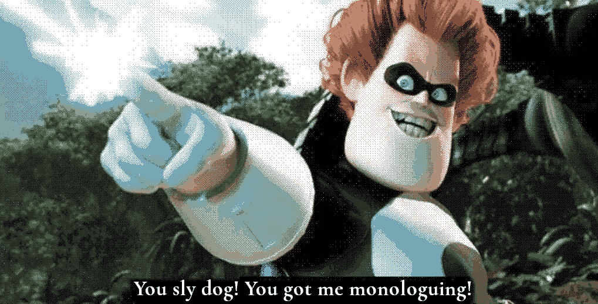

+++
title = "Thoughts on BAYOU Roots"
date = 2026-03-31
weight = 1
path = "thoughts-on-bayou-roots"
description = "My brief thoughts on and around BAYOU Roots and how we characterize characters."

[extra]
image = "slydog-indexed.gif"

[taxonomies]
tags = ["Tabletop Roleplaying Games", "RPG Blog Carnival", "Blog Bandwagon", "Tiny Epics"]
ttrpg = ["RPG Blog Carnival", "Blog Bandwagon", "Tiny Epics"]
+++

Palleon Press successfully got me monologuing too much in my [March of the Tiny Epics overview](@/community/rpg-blog-carnival/tiny_epics_round_up/index.md) so here that is to preserve the overview's flow.
I clearly have some thoughts on [BAYOU's Roots](https://palleonpress.blogspot.com/2026/03/in-roots-playing-with-habitats-and.html).
Good thoughts, and thoughts on what others consider when characterizing their characters in TTRPGs, at least from a general level probably with too skewed a recollection from the popular titles.

<!-- more -->

## On the apparent order of considerations for characters

Balloonship armada, heck yea. :]

I one hundred percent agree that habitat is not considered often enough for these little critters, or any creatures, in TTRPGs.
I'll be honest, by my perspective of TTRPGs in the little folk genre, even size isn't properly considered or the critters natural abilities.
It probably goes in the following order of consideration:
1. The vibe or fiction of the critter is certainly considered the most.  To be honest, I think this is the most important and goes to show how much a good idea or fiction can take you in our TTRPGs, even when just superficial.
    - Their aesthetic is absolutely included here.
2. Natural abilities come next. Everyone tends to enjoy sharing some animal facts.
3. Cultural or social animal things. I think of DnD and Pathfinder mentioning the culture and lifestyle of certain creatures but from recollection I don't recall dedicated sections on this in the typical books. I do know that the vibe and natural abilities come to the forefront of my mind when considering DnD or Pathfinder creatures.
4. Habitat.  As you said, very rarely discussed.  I don't really know of an instance this is focused on to a degree that matters in play.  Though I suspect Mausritter and third party content touch upon this somewhat at least as there are so many creations out there someone has had to include something habitat related in those maps, even if they aren't made with consideration of actual mice at that scale.
Another point is its one thing to broad strokes paint a world, its another to make it feel alive, broad strokes or otherwise.
    - Also worth noting I haven't played much of these third party contents or other indie games for small creatures beyond Mausritter.
    - Oh, actually I suppose Household does this well because that's the whole point and you get to have one distinct setting that gets fleshed out greatly. The House!
    - And if we're giving that to Household, then Mausritter certainly includes human sized objects from a mouse perspective, which absolutely is fun and thematic. Although that's more objects in the world than a habitat.
    Extremely eye opening how referencing common objects we human players know well from a different perspective can vividly characterize a game.

And now I'll lovingly knock one of my favorite games, Mausritter, which has inspired me to create my own. Someone else in the Discords put it well, "You're dirty little guys in mouse suits". Very [Gray Mouser](https://en.wikipedia.org/wiki/Fafhrd_and_the_Gray_Mouser). Little about mice is considered in the game beyond the vibe or fiction of being that critter.
Of course this means we miss out on the grand time of being essentially blind, and relying on our whiskers to see, and other not so appealing mouse traits, so perhaps Isaac Williams was onto something all along when he made this great, beloved game.
I think so.

Aahhh...

... Anyways. ***Give me biomes!***
This is an important part of the creatures and I have only heard of [Skerple's Monster Overhaul](https://coinsandscrolls.blogspot.com/2023/02/osr-monster-overhaul-megapost.html) book including "lairs" for creatures (this book looks to be the gold standard for monster/creature books, afaik).
When I release my first book for Small Souls expect it to have the creature's homes and habitats in these biomes along with their frequent neighbors.

BAYOU's Roots is a smart idea expressed in this post.
I also am a big fan of things that ground a character in the world and society.
I've similarly found that well worded questions can help players flesh out a character and the world.
I think this [post is well worth the read](https://palleonpress.blogspot.com/2026/03/in-roots-playing-with-habitats-and.html)!
