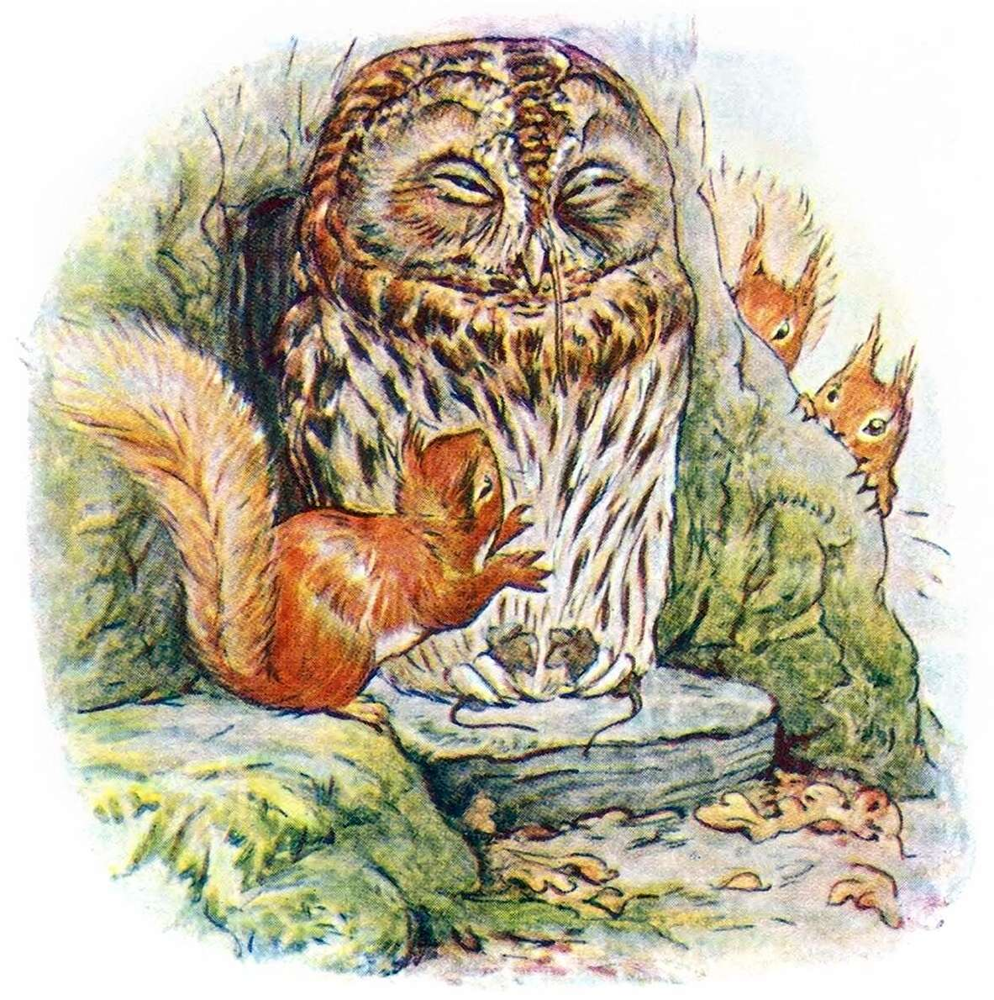
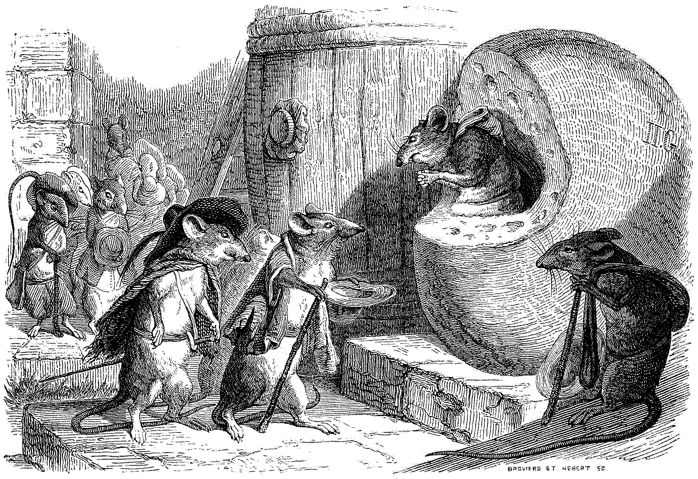
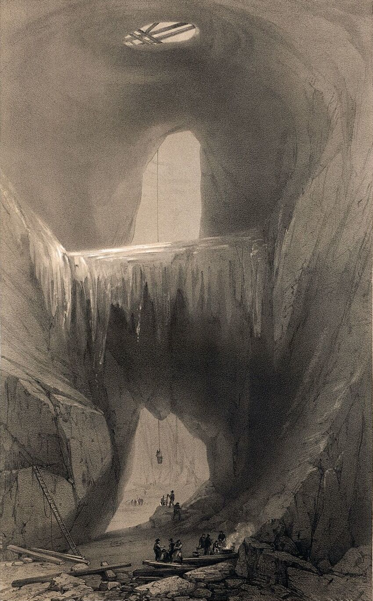
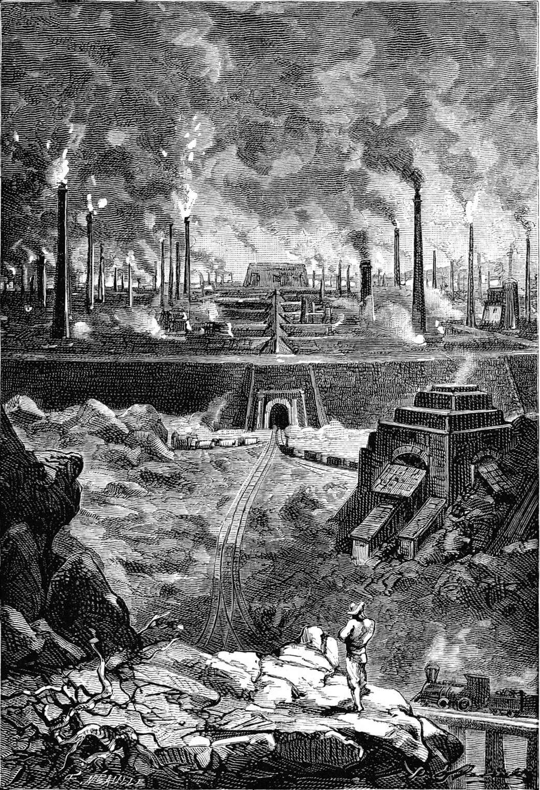
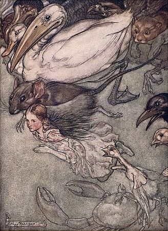

+++
title = "Tiny Epics: Small Souls in a Big World!"
date = 2026-03-01
path = "tiny-epics"
description = "The small ones among us are sometimes overlooked, but they surely have grand tales to tell! This March, let's explore these tiny epics for the RPG Blog Carnival!"

[extra]
image = "squirrels_sneak_owl_shut-eyes_mice_in_talons_1600.jpg"

[taxonomies]
tags = ["Tabletop Roleplaying Games", "RPG Blog Carnival", "Blog Bandwagon"]
ttrpg = ["RPG Blog Carnival", "Blog Bandwagon"]
+++

The small ones among us are sometimes overlooked, but they surely have grand tales to tell! This March, let's explore these tiny epics for the
[RPG Blog Carnival](https://ofdiceanddragons.com/rpg-blog-carnival/).
This is a community event, so we'll ponder some ideas for this theme, then get to creating and start some discussion!
Share your creations with me early and I'll do weekend updates along with a final roundup on March 31st.

<!-- more -->

An illustration from Beatrix Potter's
<a href="https://en.wikipedia.org/wiki/The_Tale_of_Squirrel_Nutkin" target="_blank">The Tale of Squirrel Nutkin</a>.
 Who are the players? The squirrels? Maybe those mice clasped in those talons?

## On Tiny Epics

As this month's host, I want to hear all about your
- **Experiences**
    - Games you've read or played where your characters or NPCs were physically small.
    - Games where your characters were metaphorically small; underdogs overlooked or ignored but went on an epic journey that made all the difference!
    - Or perhaps the side quests along the way that seemed tiny yet turned into so much more.
    - Reviews, play reports, musings and rants! Oh my!
- **Creations**
    - Unique little critters to serve as interesting allies or enemies, regardless of the player character's size!
    - Got a new monster idea? Swarms? A towering monster that makes the players feel small?  Write up an ashcan draft!
        - Tiny pixies? *Bees?* Gargantuan hermit crabs?
    - Your weird lil' guys who leave a lasting impression.
    - Dungeons in miniscule like
        - Alice in Wonderland "swimming in tears".
        - "Honey I Shrunk the Kids" shenanigans.
- **Designs**
    - Recommendations for playing smaller creatures in our natural world.
    - How can we capture that David vs Goliath experience or that Shadow of the Colossus boss battle?
    - Take your typical adventure and consider how smaller creatures could solve it.
        How could a mouse fell a dragon? What about a vampire lord?
    - What is a world like with sentient creatures both small and large? Do their societies intermingle?

Or anything else you can think of that pertains to being or feeling small or large! Create it and share it and let's have some fun.

Illustration from J. J. Grandville's
<a href="https://www.oldbookillustrations.com/illustrations/rat-retired/" target="_blank">
Fables de La Fontaine</a>.
 What's the story here? Got any thoughts?

### Some Tiny Inspirations

The theme is purposefully broad. Stretch and play with it as you please.
There are various games out there already that explore this theme, such as the genre of small anthropomorphic creatures of varying similarities to humans, including
- [Mausritter is free](https://mausritter.com/srd) with lots of [community made content](https://library.mausritter.com/) for mouse adventures.
- Root: the TTRPG with their various [free quickstarts](https://www.drivethrurpg.com/en/product/378106/root-the-rpg-bertram-s-cove-quickstart) for territorial woodland wars.
- Pico with their [free playtest document](https://felixisaacs.itch.io/pico-hogwild-playtest-pre-gens) for tiny bug adventures.
- [Household](https://twolittlemice.net/household/) and its [quickstart](https://www.drivethrurpg.com/en/product/421014/household-quickstart) for little fairy or "boggart" adventures.

If you're looking for more related media, I'll soon release a collection post of all the different little people stories, film, videogames, and other TTRPGs for your further inspiration and curiosity.

<a href="https://www.oldbookillustrations.com/illustrations/dannemora-mine/" target="_blank">

Dannemora mine.
</a>

<a href="https://www.oldbookillustrations.com/illustrations/stahlstadt/" target="_blank">

Stahlstadt.
</a>

The world can make us <em>feel</em> quite small, regardless of our size!

## The RPG Blog Carnival

The [RPG Blog Carnival](https://ofdiceanddragons.com/rpg-blog-carnival/) is a monthly community event that's been encouraging blogging on a shared theme within roleplaying games since August 2008!
A blog carnival is a good way to connect with other bloggers, have some discussions, and share our thoughts.

Last month's theme was "[Dragons, Gods and other Powerful Beings](https://seaofstarsrpg.wordpress.com/2026/02/28/ending-this-months-rpg-blog-carnival-gods-dragons-and-other-powerful-beings/)" hosted by Sea of Stars.
Feel free to check out the past months' writings or look ahead for what this year has in store on the [main site](https://ofdiceanddragons.com/rpg-blog-carnival/).

Arthur Rackham's illustration from
<a href="https://www.gutenberg.org/ebooks/28885" target="_blank">Alice in Wonderland</a>.
 It's the community that matters!

## How to Participate?

Simply write up a blog post this March and link back to here!
Then share it with me on your preferred communication channel, such as social media.
I currently don't have a comment section, so feel free to comment on [this post in my subreddit](https://www.reddit.com/r/ErrantThinking/).
Otherwise use whatever you want.
I'm `ErrantThinking` everywhere. Feel free to `@` me.

Feel free to create something besides the typical blog post too!
A piece of art? A poem? A video? A game hosted somewhere like itch.io? I gladly welcome all of these as long as they are hosted somewhere *publicly* accessible to all.
However, I encourage you to consider posting to your own blog or website.
To have your own space separate from these platforms is very freeing and empowering and is in the spirit of the RPG Blog Carnival.
Heh heh, perhaps that's the start of your *own* tiny epic?

I will write the final round up post on **March 31st**, a Tuesday.
To keep it interesting, if you share your public creations with me earlier, I will do a week's end post on the weekends prior to the 31st.
Perhaps we share our works in progress?
I like to foster more communication and dialogue between creators in these kinds of community events, so let's create and talk!
