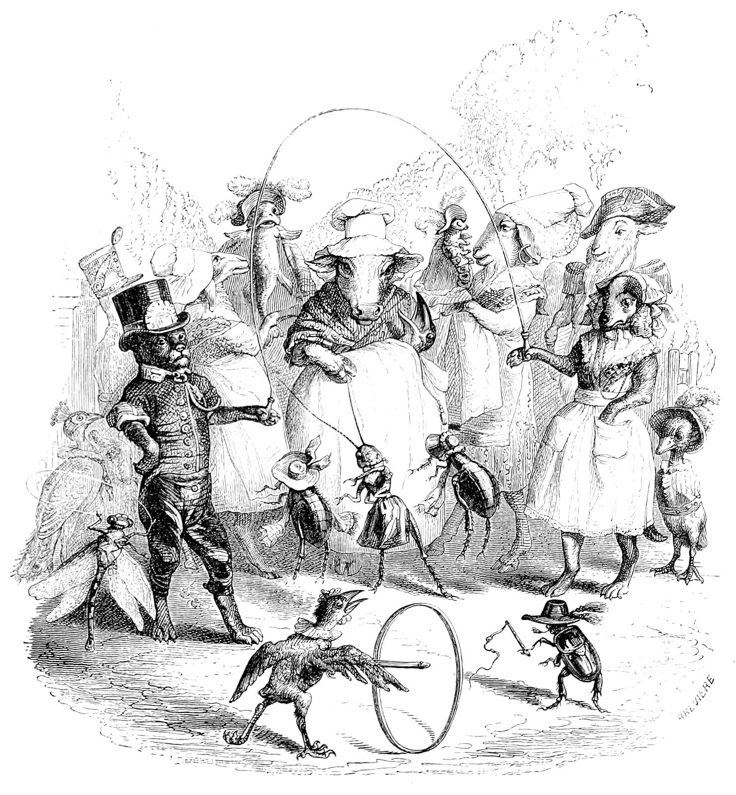
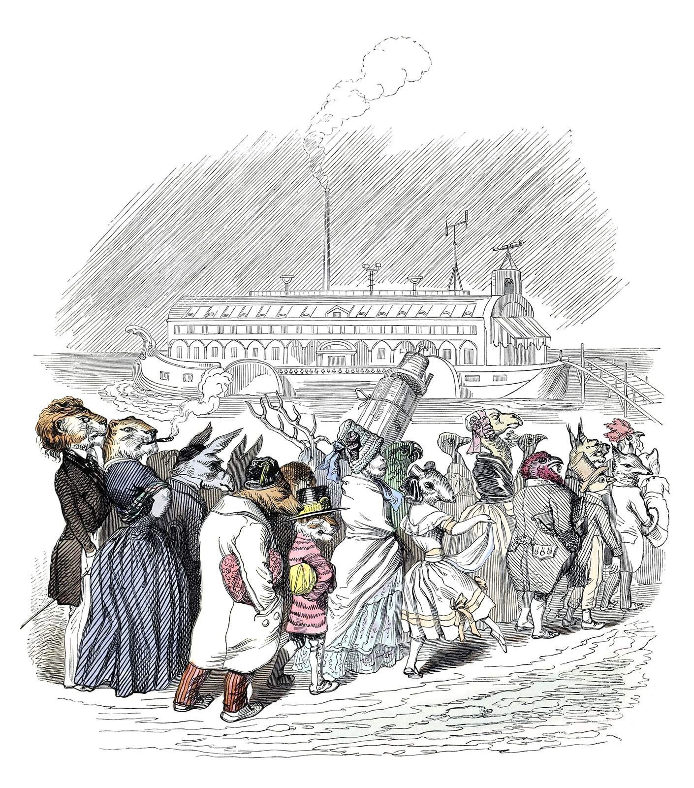

+++
title = "Tiny Epics RPG Blog Carnival Round Up"
date = 2026-03-31
weight = 1
path = "a-tiny-epics-round-up"
description = "As the March of the Tiny Epics ends, I provide the final round up."

[extra]
image = "preservation-species-1600.jpg"

[taxonomies]
tags = ["Tabletop Roleplaying Games", "RPG Blog Carnival", "Blog Bandwagon", "Tiny Epics"]
ttrpg = ["RPG Blog Carnival", "Blog Bandwagon", "Tiny Epics"]
+++

As the [March of the Tiny Epics](@/community/rpg-blog-carnival/tiny_epics/index.md) comes to a close today, I give one last "Hurrah!" for all those who participated throughout this month.
Thank you everyone for participating and sharing your wonderful TTRPG creations and reflections on the theme of "Tiny Epics: Small Souls in a Big World!".
You all had great things to share and I'm glad to have read each and everyone of them.
Let's celebrate the participants and their creations!

<!-- more -->

An illustration by <a href="https://www.oldbookillustrations.com/artists/grandville-j-j/" target="_blank">Grandville, J. J.</a>
"<a href="https://www.oldbookillustrations.com/illustrations/grandville-park/" target="_blank">Fashionable Public Gardens</a>".

## The Early Marchers
I have written overviews of these wonderful contributions earlier in the month.
I'll link to each overview and list the contributions.

### March came in like a lamb

In terms of early published works, March came in like a lamb.
However, I was delightfully surprised by how many people were interested and discussing what to create so early on.
I enjoyed discussing ideas with those of you who reached out and if you weren't able to get around to posting, please share them with me in the future and I'll gladly be a reader and appreciator of your work!

I shared a collection of [little folk in stories & media](@/soul_system/little_folk_media/index.md) from my notes as some inspirational sources or as an "Appendix N" for the genre of little folk.

### Amidst Tiny Epics

In the [middle of March](@/community/rpg-blog-carnival/amidst_tiny_epics/index.md) we had couple of brave souls lead the way.

- "[The Borrowkins](https://vulcanstev.blog/2026/03/10/tiny-epics-an-rpg-blog-carnival-the-borrowkins/)" by Vulcan Stev
- "[A Wanderhome Setting](https://www.cozyquestlog.com/small-souls-in-a-big-world/)" by K. Chase Tramel.

### At the Height of the March

The [March of Tiny Epics](@/community/rpg-blog-carnival/march_of_tiny_epics/index.md) crescendoed this week with these great contributors:

- "[Underlog, A Pocket Setting](https://elementalreductions.blogspot.com/2026/03/underlog-pocket-setting.html)" by Empedocles at Elemental Reductions
- "[Rescaling Encounter Maps](https://seedofworlds.blogspot.com/2026/03/rescaling-encounter-maps-for-tiny-epics.html)" by Xaosseed of Seed Worlds
- ["Tiny Tales", a Campaign Retrospective](https://playtestdummies.substack.com/p/tiny-tales) by Chsitropher Kurts at Playtest Dummies

## The Final Weeks

These folks helped us finish out strong and they deserve a proper overview that the others received.
So we'll give them just that!

### Feel Tiny in RPGs in Four Distinct Ways

"[Feel Tiny in RPGs in Four Distinct Ways](https://vdonnutvalley.bearblog.dev/feel-tiny-in-rpgs-in-four-distinct-ways/)" by Vdonnut at VDonnut Valley on March 29th covers four different ways to make the player characters *feel* small.
- Physically
- Stuck in resource scarcity
- As specks of dust in space
- Beholding incomprehensible eldritch horrors

For each they provide TTRPGs that do just that and offer insights into how they accomplish that feeling.
Vdonnut also notes some TTRPGs that *do not* emphasize this feeling and what their games ignore that you can further emphasize.
Considering these different perspectives together is good food for thought!

### A Big Idea: Borrowers but Punk Rock

[My Big Idea: Borrowers but Punk Rock](https://dungeonsandpossums.com/2026/03/march-rpg-blog-carnival-tiny-epics/) by Dungeons & Possums on March 29th provides a lovely reflection on Wind in the Willows and Mole's Christmas in their life from the past to the present.
I too grew up on Wind in the Willows and dearly adore the book.
Cozy. Comfy. Nostaligc.
And then they provide a whole different perspective!
What if the Borrowers but punk rock against "The Bigs"?
This is a fresh take and one you don't want to miss!

>Editor's note: I forgot to include this late last night. My apologies. I'm glad I caught it the next morning! If there are any others I have missed, please reach out and let me know!

### In the Roots: Playing with Habitats & Ecosystems

"[In the Roots: Playing with Habitats and Ecosystems in My Bayou RPG](https://palleonpress.blogspot.com/2026/03/in-roots-playing-with-habitats-and.html)" by Palleon Press on March 30th as they join the RPG Blog Carnival for the first time!
I'm glad you joined it this month!

First thing I noticed was your use of Gus Dirk's illustrations for "Bugville Life: For Big and Little Folk", which is a 1902 book by Richard Kendall Munkittrick I was not aware of!
So thanks for sharing that.
I'll have to add it to my collection.
I really enjoy discovering older works like this in this genre and seeing some really grand illustrations.
Gulliver's travels being another fine example, and certainly Beatrix Potter's illustrations!

I also am a big fan of things that ground a character in the world and society.
I've similarly found that well worded questions can help players flesh out a character and the world quite well.
I think this post is well worth the read and that BAYOU Roots is a useful concept to keep in mind.

I shared more of [my thoughts here](@/community/rpg-blog-carnival/thoughts_on_bayou_roots/index.md).

### An Overview of 3DIE6 RPG

A [3DIE6 RPG Overview](https://leicestersramble.blogspot.com/2026/03/rpg-blog-carnival-small-souls-in-big.html) by Vance A. at Leicester's Ramble on March 30th.
I'm glad you did because somehow I missed this one!
Oh wow this game sounds awesome.
This is a cool concept for a game and I enjoy the focus on being ant sized creatures.
I can't say much more because its all well written over at Leicester's Ramble.
Give it a read!

### Small Souls Design, Relative Resolution, & a Creature

I wrote up my [macro design goals](@/soul_system/design_goals/index.md) for Small Souls, the [relative resolution mechanic](@/soul_system/relative_resolution/index.md) it uses, and a tiny creature using its character specification, the [camellia fairy](@/soul_system/camellia_fairy/index.md).

Some fresh news is that I released for free my ashcan hack of Mausritter, "[Kleinritter](https://errantthinking.itch.io/kleinritter)", on itch.io, which was a very early version of Small Souls that I've since deviated the design from substantially.

I didn't get around to a write up of anthropomorphic setting questions, or a one page dungeon like I hoped this month, but you all know I'll be sharing more for this genre in the future!

An illustration by <a href="https://www.oldbookillustrations.com/artists/grandville-j-j/" target="_blank">Grandville, J. J.</a>
"<a href="https://www.oldbookillustrations.com/illustrations/preservation-species/" target="_blank">The Preservation of Species</a>".

## The March Concludes

We have come to the end of this March.
It's been fun!
If you haven't read some of these posts, I recommend giving them a read and reaching out to discuss, maybe even write your own.
Whether you're writing about tiny heroes or grand kaiju, I'm certainly interested.
The RPG Blog Carnival is all about blogging and creating.
Maybe you wanted to participate in this month but got busy?
Or you wanna do more?
Well, don't worry because the carnival continues!
Check out [the RPG Blog Carnival website](https://ofdiceanddragons.com/rpg-blog-carnival/) for past carnivals, their submissions, or to join the next one!
