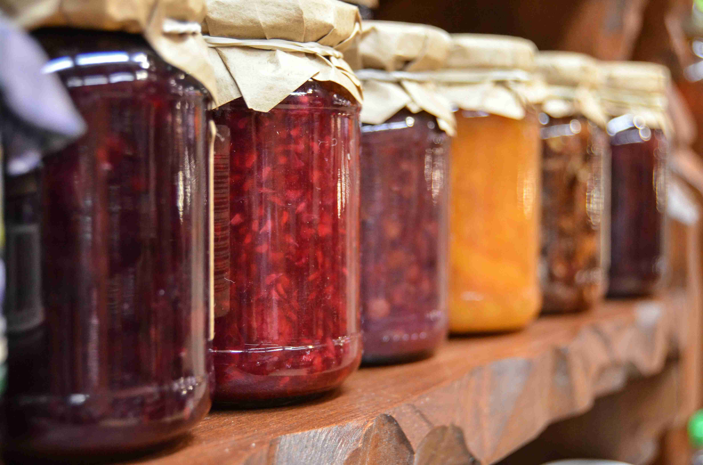

+++
title = "Granny Jam"
date = 2025-07-31

[taxonomies]
tags = ["Tabletop Roleplaying Games", "Collaborative Prompts"]
ttrpg = ["Character", "Collaborative Prompts"]
+++

In the [NSR Cauldron Discord](https://discord.gg/tsJ93PyuJH), I wrote a community prompt in hopes that I could get a community effort to characterize Granny Jam, a character I made up who specializes in creating magical jams and jellies.
Under the pretense of creating magical jam and jelly items coupled with sharing stories of a time when Granny Jam used those jams, I was hoping we would discover the emergent character of Granny Jam and come to a better understanding of who she is as more people shared (made up) stories about her and her wares.

It never took off, but I do love the initial concept of Granny Jam and this idea for emergent characters from collaborative prompts.
I wanted to share her here, at least through what I originally wrote up for the collaborative prompts.

<!-- more -->

## Granny Jam Collaborative Prompt

Tis the time of year when Granny Jam pays a visit and brings her wondrous homemade jams! She's got all types of jams from those you'd expect to some incredible oddities. Some are more complete than others. She even sells or gifts their associated paraphernalia for their use or for making them!

What are some of Granny's jams that left a lasting impression on you?
Tell us about the jam! If you cannot remember all of the details, share what you can. I'm sure someone else will remember the details of her quirky jams and assortments! They may even remember another one of her jams.

- **Name of Jam or Paraphernalia**
- **Description**:  Describe the physical item and any hints of what it does. Flavor text.
- **Effects**: Describe the game system agnostic or specific effects
- **Recipe**: If you know the recipe (in the narrative/game or irl), feel free to share!
- **Memorable Moment**:  Share a little story about when this one of Granny's oddities left an impression on you.

Doodles of Granny's jams & paraphernalia are welcomed, if you're so inspired. As is anything else that was memorable!

### One of Granny's jams I remember
**Ooze in a Jar**

**Description**:  One of Granny's unfinished jams got in the mix and when Uncle Fester opened it for his morning toast, well... We needed to call in the town healer quick!

How does Granny fit so much ooze in one jar?

... And what even is an ooze jam?!

**Effects**: Throw the jar and once it shatters or opens, a wild living Ooze is released! (Medium sized creature)

## Gran's Coffee Jam

**Description:** This brown gritty jam is a bitter kick in the can to get you moving! Good for speeding up a slow morning or getting your lethargic buddies hustling when the mob is on your heels!

A hastily scrawled note is attached to this jam "Clearly mark the unfinished ooze jam!"

### Effect
- Standard turn to consume. 8 servings per jar.
- *Overstimulated*: Effects last for a duration of 10 min, unless otherwise stated
- Haste : [https://www.dndbeyond.com/spells/2138-haste](https://www.dndbeyond.com/spells/2138-haste)
- Ignore any effects of exhaustion for duration
    - +1 level of exhaustion after duration
    - Next long rest won't recover any exhaustion levels
    - Cannot sleep for 6 hours by non-magical means
- Jitters :
    - -1 to checks for careful actions.
    - +1 to reflexive and reaction time checks.
- Mind racing: -1 to starting and +1 to maintaining actions related to concentration or focus

### A Memory
I remember one summer's day helping Granny Jam unpack her wares at a farmer's market. She offered me some coffee jam toast, "To start the day off quick," she said with a wink. While unpacking, she was shaking terribly and she knocked over a glass jar of deep purple jam.  The jar fell and shattered on the ground making a massive purple puddle. "Oops!" she chuckled, "Well, I have more grape jam anyways."  As she turned away, I saw the puddle gurgle and wiggle and then rise to form a mound. I tugged on Granny's sleeve as the purple mound sped over to the Butcher's fresh cuts!  "Not again!" cried the butcher, "Granny Jam!"

I've never seen Granny pack up and run so fast!

## A few named jam ideas

### Gran's "A Taste of the Sun" Jam
**Description**: (partial) Down in the dumps? Take a taste when you want to remember the sunny days of mid summer! You'll forget all your past worries immediately!

### Gran's Espresso Jam
More intense coffee jam. 😆

### The All Seeing Jam
**Description**: (partial) Lost your glasses? Lost your way? Find that which is missing with this jam!  Now, just don't misplace this...
