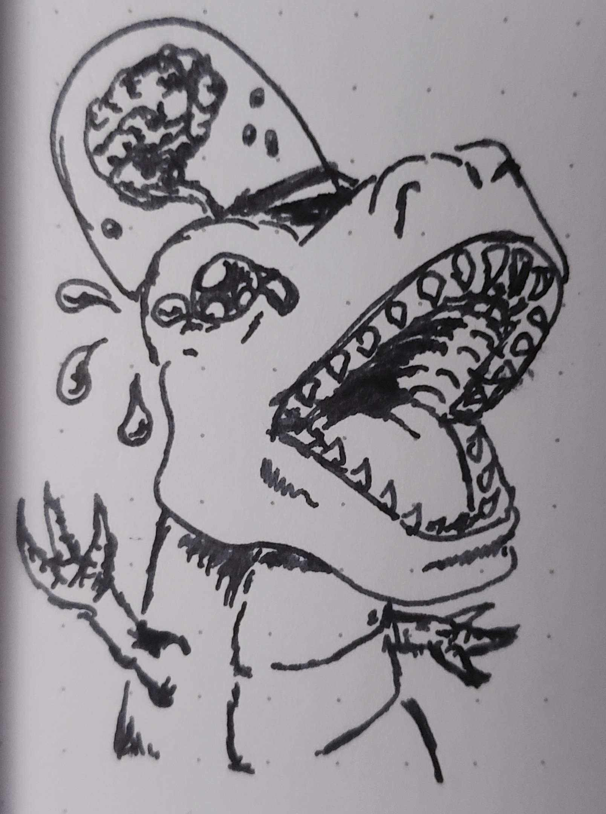
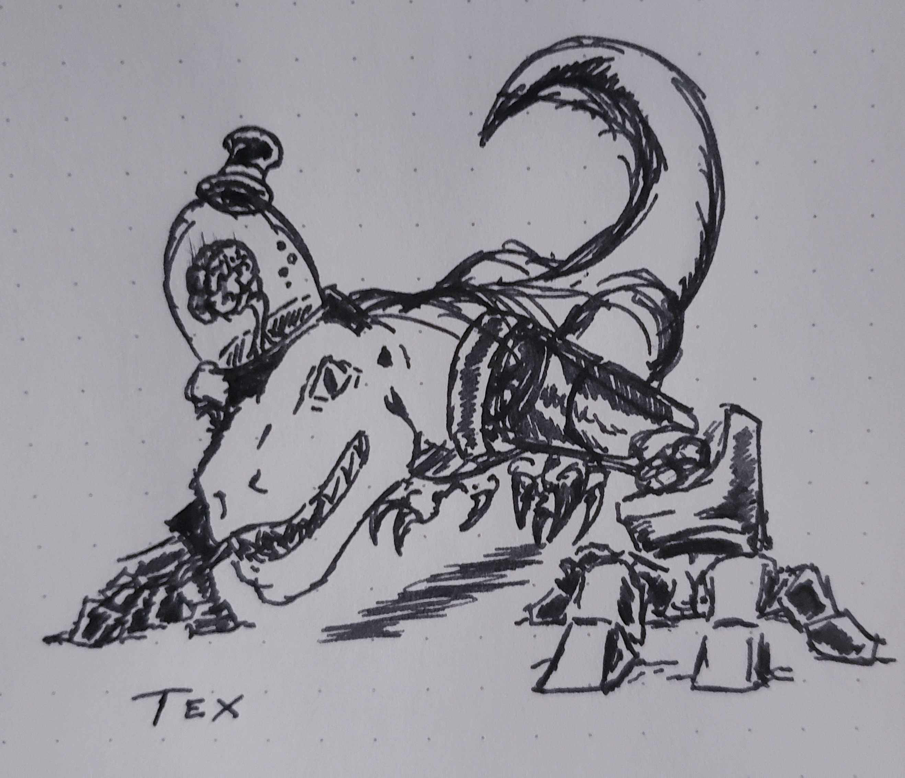
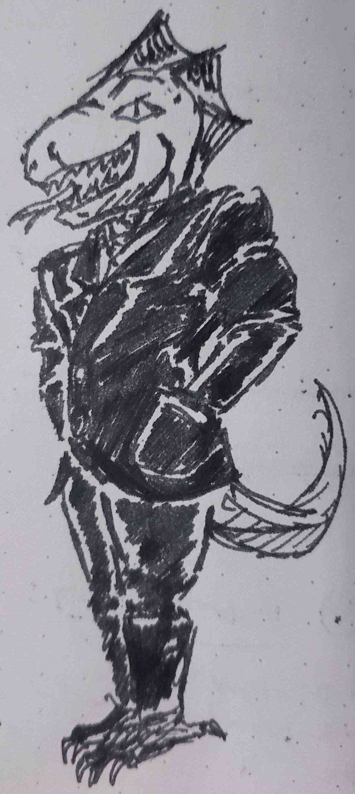

+++
title = "Enlightened Retro Sci-Fi Uplifted Dinosaur Kingdom"
date = 2025-07-31

[taxonomies]
tags = ["Tabletop Roleplaying Games", "Secret Santicorn", "OSR", "Christmas in July"]
ttrpg = ["Secret Santicorn", "Midsummer Santicorn"]
+++

It's [Christmas in July](@/christmas_in_july_2025/index.md) and I'm delivering a missing present to Fairdragoon from Secret Santicorn 2022.

## The Prompt

> Cities, politicians and/or ministries of the enlightened retro-sci-fi uplifted dinosaur kingdom for a political/intrigue style game

This was a lot to take in for me, but after a bit I got something fun and a terrifying concept for a T-rex with monstrous mecha arms.

<!-- more -->

___

:warning: This is a stub and is under construction!  Expect more content later.
___

## The Setting

Humans have gone extinct, as far as we know.
Truly a tale about the "hubris of man", though us dinosaurs wouldn't be plagued with the knowledge of that.
It all started when the humans decided to resurrect the dinosaurs.
They were successful of course!
This is very much so *our* origins.
And fortunately for us, the humans wanted more than just dinosaur pets caged for display.
They wanted to play god even more, and so they bestowed upon the dinosaurs their intelligence.

These first dinosaurs to gain sentience are the Originators.
They had crude technology fused into their flesh.
Human brains were attached to their own enabling the use of both brains.
Naturally, this was the human's downfall, as we're doubly intelligent.

Our current king, Tex Goodfellow, is one of these originators.
He played an important part in the Originator's revolution and the extinction of the humans.

To ensure our progeny would thrive naturally without the need for the human's crude brain tech, the Originator's genetically modified their children to have their intelligence and capability naturally.
Thus was born the *Neodino*.

