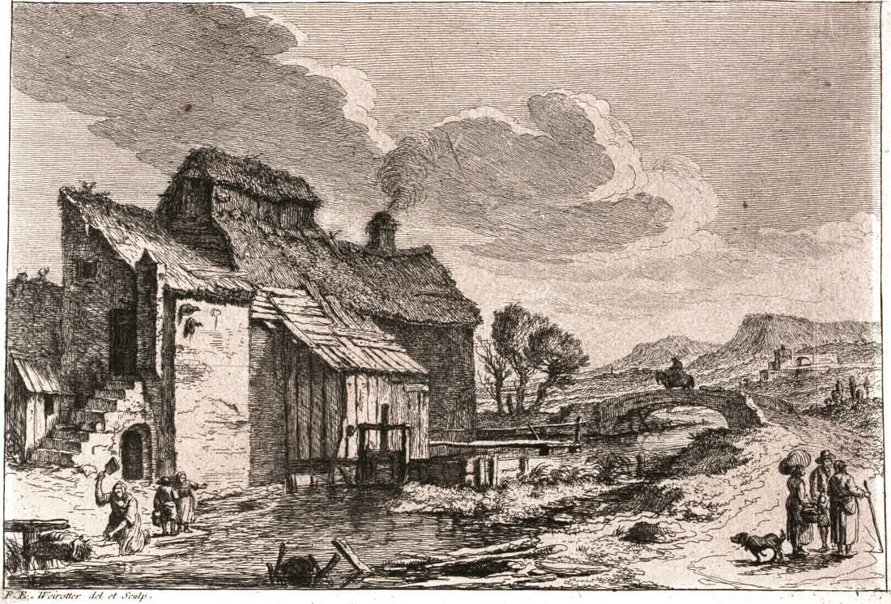
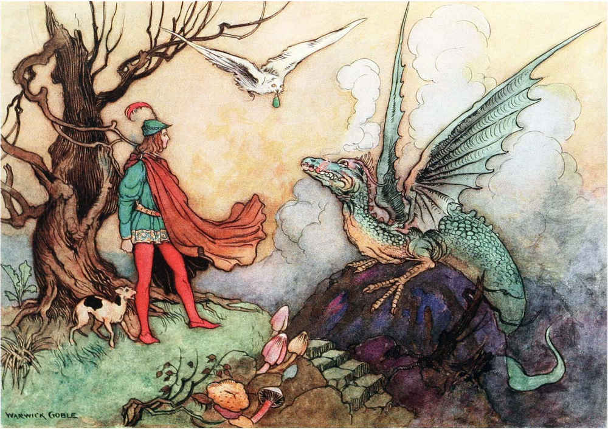
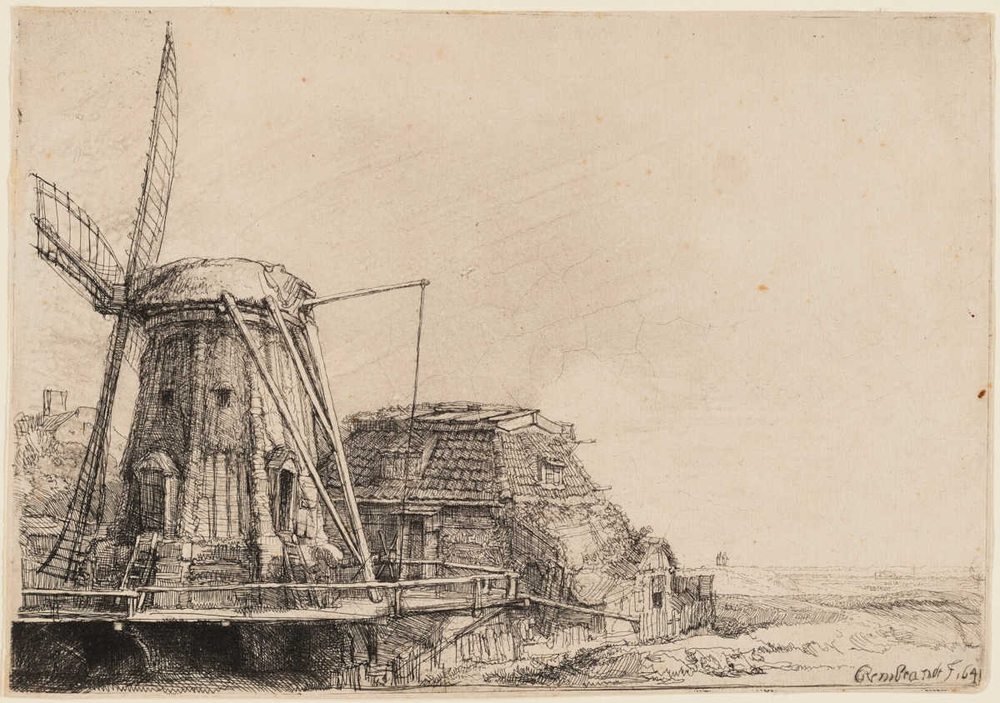
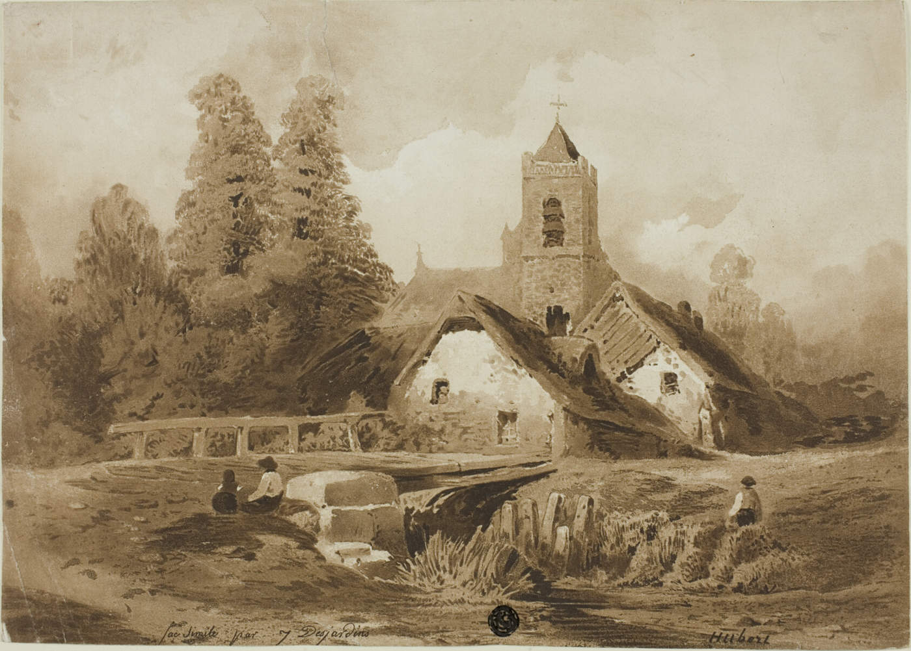
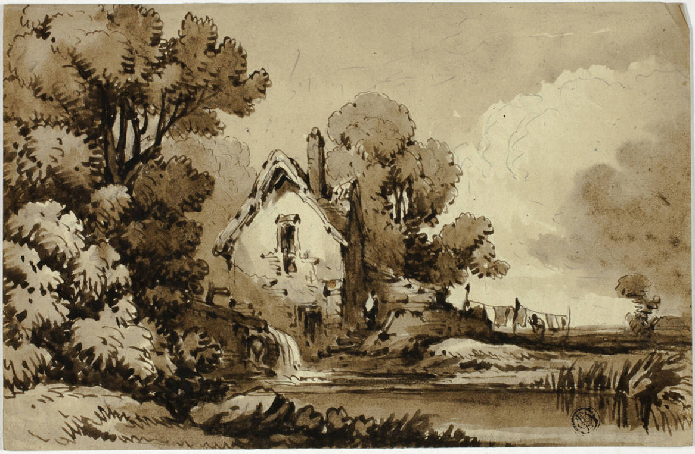
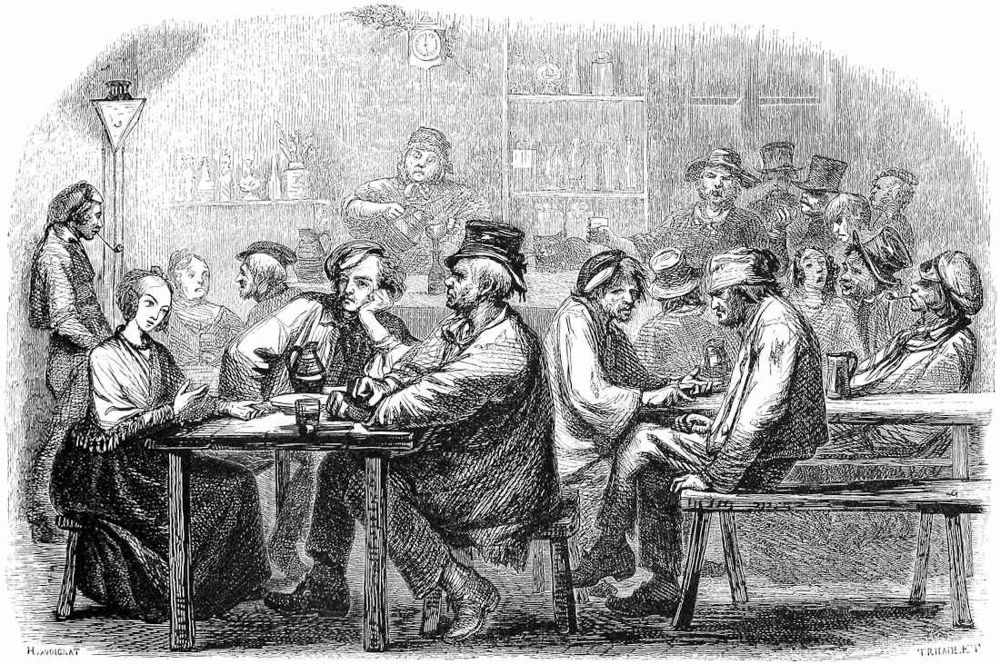

+++
title = "Roadside Inns with their Quirks & Secrets"
date = 2025-07-31

[taxonomies]
tags = ["Tabletop Roleplaying Games", "Secret Santicorn", "OSR", "Christmas in July"]
ttrpg = ["Secret Santicorn", "Midsummer Santicorn", "Tables", "Locations"]
+++

It's [Christmas in July](@/christmas_in_july_2025/index.md) and I'm delivering a missing present to Ighton of [Serene Library](https://serenelibrary.com/)
from Secret Santicorn 2022.

## The Prompt

> dHoweverManyYouFeelLike Roadside Inns and their quirks and secrets.

Excellent! I have chosen a **d20**.
I've also chosen to include some taverns or pubs without the expected option of lodging.
I have also thrown in a few in-city locations.

<!-- more -->

## Roadside Inns & Taverns

For each, I'll specify:
- **Name** of the Inn or Tavern
- **Location** of the Inn, its surroundings or ideal surroundings, besides being on a road. Feel free to ignore this and use them where ever.
- **Keeper** of the Inn, i.e., the owner.
- Type of **Building**
- a **Quirk**
- a **Secret**
- A **Description** for more flavor

Feel free to adapt these as you see fit.

### 1. Moss Dragon Inn

- **Location**: Ideally where moss grows deep in the woods, otherwise moss grows plentifully anyways and isn't that interesting?
- **Keeper**: A mossy emerald dragon
- **Building**: A cottage built of thick wood on a sturdy stone foundation
- **Quirks**: Moss dragon owner with an excellent array of food and beverage options
- **Secrets**: Moss dragon owner could be magically hiding as a common humanoid, or be out in the open.

Great food, even better drinks, but mossy bedding.
Lodging isn't its strong suit, but the merriment and soul in this place makes up for it.

Features house special drinks

- *False Apple*:
    A smooth and sweet drink that tastes like apples, but has no apples in it.
    - 20 ml Melon Liquor (Midori)
    - 40 ml Raspberry Liquor (Chambord)
    - 80 ml simple syrup
    - 20 ml lime juice
    - *Effect*: Soothes the mind, relaxes the body.
- *Moss Grog*:
    A thick green brew that tastes green and bitter and gets you ready to take on the world.
    - finely ground coffee steeped for 20 min at 80 C
        - Can use a French Press with fine filter
    - 2 handfuls of spinach
    - 1 egg's egg whites
    - 2 dashes of lime juice
    - finely blended
    - It is questionable if the barkeep ever tried this.
    - *Effect*: Reduces fatigue and exhaustion. Energizes. Constitution boon.
- *Piner's Lament*:
    Gin.
- *Seething Druid*
    A smoked gin with citrus.
    - 1 sprig of fresh rosemary
    - 1 clementine or orange
    - 1/2 lemon's worth of juice
    - 60 ml lemonade
    - 60 ml gin
    - 90 ml tonic
    - smoke the drink & glass by partially burning the rosemary
    - clementine & lemon slices added after the smoke
    - *Effect*: Energizes and Fire resistance.

### 2. Comfort Cavern

- **Location**: Where ever caves may be
- **Keeper**: A lovely dwarven couple
- **Building**: A stone building built into and carved from a cavern
- **Quirks**: Everything is finely crafted. They know everything about rocks.
- **Secrets**: The couple practice golem magics. They want to bring their well-loved crafts to life.

A lovely dwarven couple run this stone forged abode.
The cavern is comfortable and homey with good seating, bedding, food, and service.
The craftsmanship of the architecture is exquisite and you can tell it was made with love.
They live slow here tending to their craft and sharing them with those who pass by.

### 3. Tulip's Bed & Breakfast

- **Location**: For Tulip, ideally in a vegetation rich environment
- **Keeper**: Tulip, an eccentric herbologist and florist
- **Building**: A small stone tower covered in vegetation featuring a prominent and flourishing greenhouse
- **Quirks**: Large man-eating venous fly traps protect the greenhouse and property. There is an herb remedy here for nearly every ailment.
- **Secrets**: Whether Tulip knows it or not, some of her guests didn't just leave without saying goodbye.

Tulip is an eccentric herbologist who has opened her small stone tower to guests.
She sells flowers and herbs for every occasion and is ready to share all that knowledge if someone asks -- I mean breathes.

### 4. Mill on a Hill

- **Location**: On a hill or ideally where it's windy, surrounding grain farm
- **Keeper**: An old couple trying to get by
- **Building**: A windmill
- **Quirk**: Golden grain. Every harvest season there is a fox spirit that if treated well along with the fields will then leave a bundle of grain made of gold.
- **Secret**: The child of the old couple is a highway man robber. He stops by at times for a place to rest or food, and if successful brings back money to help alleviate the costs of repair and maintenance. The old couple is uncomfortable with this. Little do they all know that the fox spirit considers the treatment of others on the lands as part of its assessment for bestowing the golden grain.

A windmill with lodging to help pay upkeep. Taxes are high here, and the property and farm is too much for the old couple.

### 5. Lookout Lodge

- **Location**: Atop a grassy knoll
- **Keeper**: A down to Earth, hands on bartender
- **Building**: A watch tower converted into an inn.
- **Quirk**: The watch tower is well enough maintained & you can see far from there, as others can also see it.
- **Secret**: The local resistance to the authority meets frequently in the basement of this dwelling.

A watch tower converted into an inn.
The resistance often meets in the basement of this dwelling planning their next move against the power that conquered them.

### 6. Treetop Lodge

- **Location**: Within a forest atop their multiple tree
- **Keeper**: A family of wood elves
- **Building**: An array of tree houses connected by rope bridges
- **Quirk**: Being in the tree tops, they either run a lift or if short staffed just strongly encourage people to stay the night.
- **Secret**: A telescope on one of the observation decks points not to the sky by at a very specific location on the horizon. Folk tales say there be treasure that way, but not many come back alive to spend it.

An inn in the treetops providing lodging, food, and drink.

### 7. Watermelt Hot Springs

- **Location**: Natural hot springs
- **Keeper**: A family lives and manages the inn and hot springs
- **Building**: Stone base and wood sides building. The building is wider than it is tall. If a second story, then its consists of both an expensive suite and separately where the family lives.
- **Quirk**: Offers hot springs that soothe the soul and heal the body
- **Secret**: The owner won this place from a bet. The prior owner resents them.

A popular hot spring where weary travelers melt their worries away!
Resting here heals you quicker and much better.
People leave feeling refreshed!

### 8. Monk's Inn

- **Location**: In betwixt the middle of nowhere and a cross roads
- **Keeper**: The abbess
- **Building**: An abbey with a brewery and an inn.
- **Quirk**: They are used to guests and passerby's seeking their brew's secret recipe
- **Secret**: The recipe for their special brew

An abbey with additional housing for travelers as well as a well-renowned brewery of the monks' speciality.
Their brew is essentially the same as [Trappist beer](https://en.wikipedia.org/wiki/Trappist_beer).

### 9. Bell View

- **Location**: A clearing where a Bell tower can be heard and seen far away
- **Keeper**: Belle Poirier, ringer of bells and farmer
- **Building**: A bell tower
- **Quirk**: You know when morning is!
- **Secret**: One of the locals plans to sabotage the bell to cease its ringing.

Bell tower long used to unite the locals in time for the daily routine and in awareness of dangers otherwise.
There is more than one bell in the bell tower and it can be used to play some.
There is a magic alarm taught here that once set upon a threshold makes a sound similar to wind chimes when someone passes through.

### 10. Waterwood Tr-inn-ity

- **Location**: Somewhere with a forest and running water.
- **Keeper**: A treant, a dryad, and a water sprite.
- **Building**: A building with a water wheel but it is as if a part of the natural surroundings.
- **Quirk**:  The keepers, the secret, otherwise a waterwheel mill.
- **Secret**: The three protect a sacred natural energy source capable of great healing and that helps bring life to the surrounding area.

A peaceful mill with a waterwheel and a lovely flowing river.
All the vegetables you could eat.

### 11. Cramped Cottage

- **Location**: Roadside.
- **Keeper**: A halfling renting out their family home
- **Building**: Small cottage
- **Quirk**: Made for halflings and smaller. Normal sized and bigger can stay but won't get any well rested conditions due to the cramped space.
- **Secret**: Rude guests may lose a thing or two of theirs. The innkeeper is a sneaky fellow.

Everything is great about this place. The food is good. The drink superb. The furniture and architecture is lovely and homey.
A shame that tall folk though can't enjoy it.

### 12. Hammer & Stein

- **Location**: Roadside
- **Keeper**: Smith
- **Building**: A blacksmith's shop & forge & pub & limited lodging
- **Quirk**: If you earn the smith's favor, he'll refine your equipment or provide new ones for an affordable cost.
- **Secret**: The blacksmith is a retired world renowned smith, but he left that name and title a long time ago.

Blacksmith during the day, barkeep at night, and a grandfather all day and night.
A pub attached to a blacksmith's workshop.

### 13. Lakeside Overlook

- **Location**: Along a lake
- **Keeper**: Ol' Man Scotty
- **Building**: A quaint and spacious multiple room log cabin
- **Quirk**: A heavy dew and fog in the morning is commonplace
- **Secret**: Sometimes, figures can be seen in the fog. Some swear there is a lake monster.

Stay long enough and engage thoughtfully and respectfully with the nature and you'll befriend a Kappa or two.
Be disrespectful or hurtful to nature and you'll find out just how real that lake monster is!

### 14. Twilight Hotel

- **Location**: Any shady roadside
- **Keeper**: A shady, awkward fellow
- **Building**: A common place building, seen everywhere, but somethings off...
- **Quirk**: You always feel uneasy staying or being here. Like something is watching you...
- **Secret**: This place is cursed!

This place is entirely average except for the fact that it unnerves everyone staying here.
Unidentified stains on upholstery, scratchy bedding.
Why?  You decide.
Play into the feeling of being in an average but strange place and what it feels like to have everything just off.
This is mostly just a flee bag motel for your setting.

### 15. Tent of Mirrors

- **Location**: Anywhere there is foot traffic.
- **Keeper**: Gonzo the clown
- **Building**: A large circus tent
- **Quirk**: Fun house mirror
- **Secret**: The tent is a mimic & Gonzo is a changeling.

A circus tent on the side of the road.
It is run by a clown named Gonzo and it offers a "house of mirrors" experience during the day and lodging in the evening.
However, some who enter never are seen again.
The inside of the tent often seems as if it rearranges itself when you're not looking and it seems like an awful lot of work for a single clown.

### 16. The Common Cup

- **Location**: In an impoverished area of a city.
- **Keeper**: Gordon Weaver, a big guy just getting by
- **Building**: A beaten down building, but it still stands and does its job
- **Quirk**: Extremely affordable, rumor-rich, and all kinds of lowlife mixed with common folk
- **Secret**: A center hub for the local Thieves Guild. One way or another, you'll soon learn whether there is honor among thieves!

An extremely affordable and active pub.
Its popularity is probably in part to its low cost compared to the rest of the city, and while it brings in all kinds of seedy folk, there are also good people here just relaxing in their free time after a hard day's work.
Filled with people just trying to get by.

### 17. Elusive Libations

- **Location**: In and around the city
- **Keeper**: Exchanges hands regularly.
- **Building**: A speakeasy. Can be anything. A basement, a room in a house, etc.
- **Quirk**: Always on the move. The location changes as people avoid the local authority
- **Secret**: A rumor-rich environment, especially for factions against the current authority. To be in on this speakeasy's movements is to be one step from some of the big crime factions.

A speakeasy hidden in the city avoiding the local prohibition laws.
If you saw someone here, no you didn't.

### 18. Bard's Bounty

- **Location**: In a bustling area in a city (downtown)
- **Keeper**: Fabian Gaillard, a famous bard in retirement
- **Building**: A theatre converted into a tavern and inn
- **Quirk**: Features extravagant plays, fine dining, and is all the rage.
- **Secret**: The bard once went on an adventure from which their spoils allowed them to buy this place, which has easily earned them back their investment and more.

Located in the bustling downtown center right off the main road, a theater converted into an exquisite dining experience with a few yet expensive rooms available.

### 19. The Bountiful Beetle

- **Location**: In clearing out in the open
- **Keeper**: Alberta "Bertie" Bigsby
- **Building**: An inn carved out of & built into a giant beetle carcass.
- **Quirk**: Its a inn carved out of a beetle
- **Secret**: There's a bug cult about! They believe the bugs' spirits linger and their knowledge is attainable.

In the wilds, a gigantic carcass of an ancient beetle rests.
The hardened exoskeleton has been carved into by the inn keep to form the common dining area, the kitchen, and the private rooms.
The eccentric owner claims to have painstakingly carved these walls and halls herself.

### 20. Strider Inn

- **Location**: Along its commonly traversed path
- **Keeper**: A Strider Rider
- **Building**: A massive, mobile, shelled bug on tall legs with its shell carved out
- **Quirk**: The mobile shelled bug building
- **Secret**: The rider knows where more of these bugs are and how to find them.

A massive, mobile, and thriving shelled bug whose shell has been carved into a common area and a couple rooms.
A smooth ride and a night's peace.
The bug rider is also the innkeeper.
They travel on a routine circuit, however with proper incentive the rider is willing to do targeted destinations at a premium.
