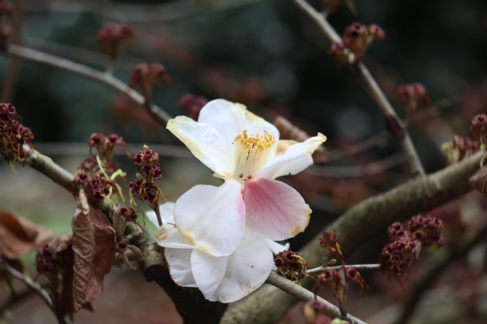
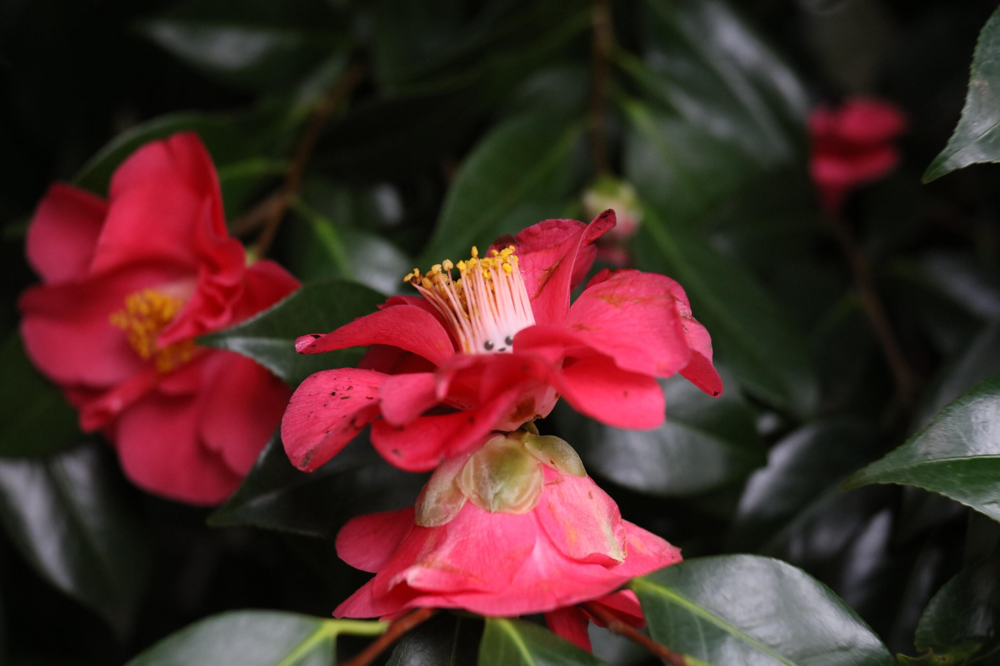
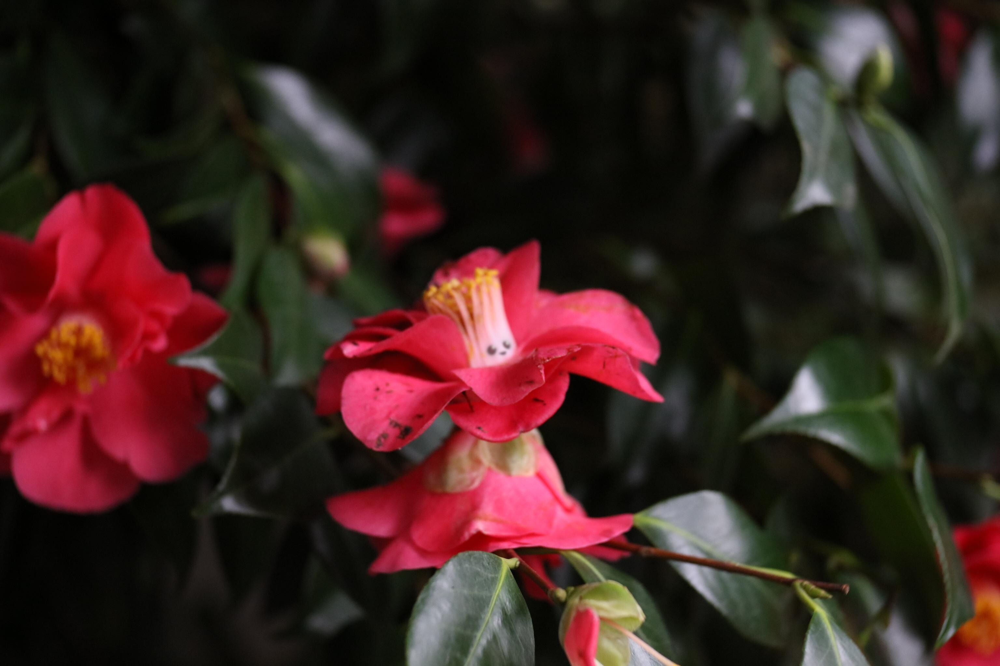

+++
title = "Flower Folk: Camellia Fairy"
date = 2026-03-31
weight = 2
path = "camellia-fairy"
description = "An ecologist's notes on the camellia fairy. A wondrous creature and even better dancer."

[extra]
image = "camellia-fairy-blush.jpg"

[taxonomies]
tags = ["Tabletop Roleplaying Games", "Small Souls", "Creature", "Tiny Epics"]
ttrpg = ["Small Souls", "Creature", "Tiny Epics"]
+++

As part of the [March of the Tiny Epics](@/community/rpg-blog-carnival/tiny_epics/index.md), I wanted to add a [Small Souls creature](@/soul_system/relative_resolution/index.md#a-character-s-aspects) inspired by the [Becorns of  David M. Bird](https://www.davidmbird.com/) and from a walk in a park.
I present to you one of the many flower folk, the *Camellia Fairy*.

<!-- more -->

A blushing camellia fairy whose white petals flush pink when excited or, perhaps in this case, nervous.

They sit upon a wilting tree.  Do you approach, or leave them be?

## Camellia Fairy

These delicate flower folk are known to be quite shy among strangers.
However, when they're among good company and familiar faces, they are known to be quite lively and jovial.
They often dance, especially in the sun, and in doing so their petals become vibrant from their excitement.
This is known as the camellia fairy blush.

Like the camellia flower, these fairies' petals have a natural coloring of a varying red tint.
The paler their natural pigment, the more evident their blush.

Camellia Fairies are peaceful and tend to their home and neighboring vegetation.
When feuds occur nearby, only the bravest of the camellia fairies will attempt to mediate.
After all, they are quite delicate compared to creatures of their own size.
What they lack in vigor is made up for with their blossoming spirit.

In surplus years of growth among their camellia trees, they may at times trade fallen leaves for others to use in tea.
The tea is said to ignite the spirit of any who consume it.
Even the most fearful or the frailest can feel the spark of their soul alight and enable them to perform unexpected feats.

A dancing camellia fairy raising her petals to the sunlight.

Inspired by [Reach of the Roach God](https://rpggeek.com/rpgitem/391386/reach-of-the-roach-god), [Idle Cartulary's posts](https://idlecartulary.com/2025/07/22/got-no-game-should-your-module-be-system-agnostic/), and [Lore Blocks](https://www.explorersdesign.com/designing-lore-blocks/), I've decided to write a somewhat poetic description, although not following any exact schema.

>*Extraordinary, yet frail. A floaty, witty, diplomatic dancer.
Pacifying pollen plumes. An indomitable spirit.*
>  
>Shy to strangers, yet a jovial, devoted friend.
A peacekeeper in trying times with a surprising resilience.
>  
>Spirit Raiser/Razor: A burning passion that may either raise or raze spirits.

A typical camellia fairy compared to your standard fare mouse 🐭 in [Small Souls](@/soul_system/relative_resolution/index.md#a-character-s-aspects):

|Creature|❤️ |🛡️|⤤|💢|💨|🧠|⚝ |
|--|--|--|--|--|--|--|--|
|Camellia Fairy|10|0 |0 |1 |2 |6 |7 |
|Mouse|14|0 |0 |4 |4 |4 |4 |

The typical camellia fairy and mouse are in the same size class both standing about 3-6 inches tall.
The mouse uses the expected values of my current version's Heart and Aspects.
In my playtests, I found this heart of 14 or higher to either be too high or I simply didn't apply enough pressure on the players.
Heart is currently rolled summing the highest two of 3d6 and adding 6.
I recommend for one shots to exclude the additional +6.
Each aspects is rolled using 2d4 where you halve the lowest, round it up, and add it to the highest.

On the resilience of the camellia fairy, the ⚝ spirit aspect in Small Souls may be spent by a creature to use "Too Determined to Die" or "No Rest for the Willful". "Too Determined to Die" is for a chance to take Spirit loss instead of loss to another aspect.
"No Rest for the Willful" is for the chance to stir yourself back to consciousness when incapacitated.
Like the camellia flower which blooms in late winter, these fairies have a mild resistance to cold.

An elegant camellia fairy enjoying the sunlight.

## Creating a Camellia Fairy

These two camellia fairies pictured are made by simply putting two fallen [camellia](https://en.wikipedia.org/wiki/Camellia) flowers together with a small twig through their centers.
The ones I found lying around already had holes in their middles for the right size, so I seized the moment.
The two flowers together look like an elaborate dress with a high collar.
I had to apply some pressure to bend or break the petals on the top to reveal the center.

My friend and I mused about having a small kit to take when on such walks.
A portable hot glue gun with a natural resin based glue or simply clay would be eco-friendly options for adhesive.
Then you can leave a little creature about your nature walks!
For now, using what's available works with some post processing of the face, which is what David does for the Becorns, anyways.

Happy Spring!
