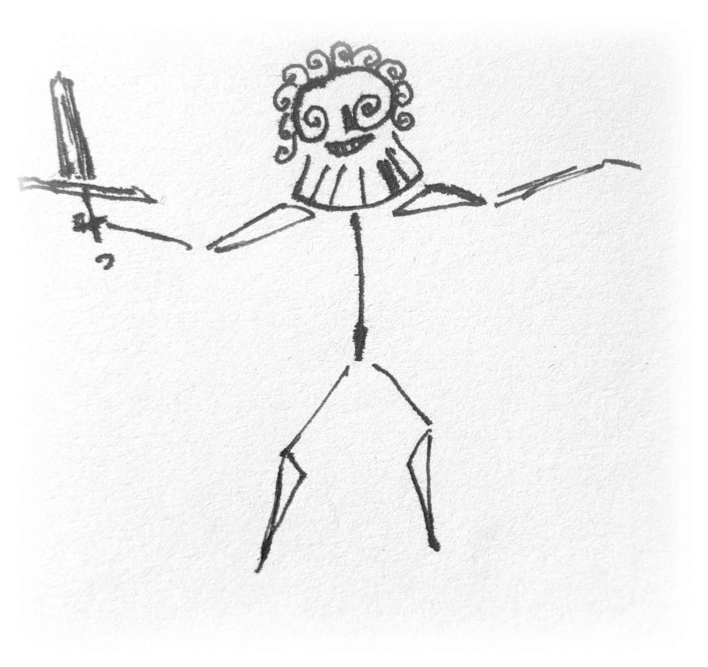
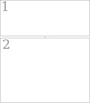
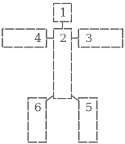
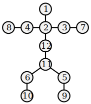
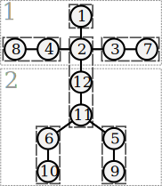
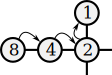
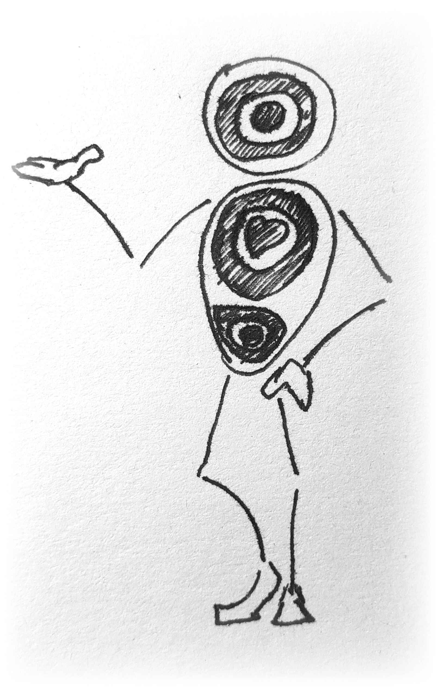
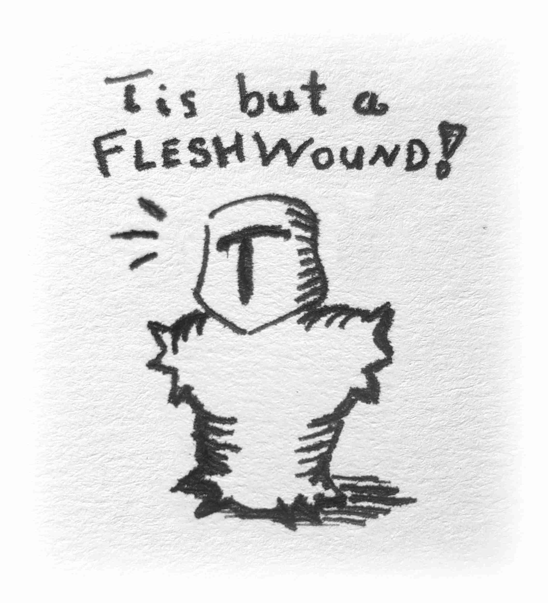

+++
title = "Hit Graphs: From Stick Figures to Hit Locations"
date = 2026-06-10
path = "hit-graphs"
description = "Pin point precision in your TTRPGs with stick figures and graphs."

[extra]
image = "tis_but_a_fleshwound.jpg"

[taxonomies]
tags = ["Tabletop Roleplaying Games", "Soul System", "Small Souls", "Design", "WIP"]
ttrpg = ["Soul System", "Small Souls", "Design", "WIP"]
+++

Ever want to hit an exact location on your enemy in your tabletop roleplaying combat?
A headshot, nonlethal blow to the knee caps, or that cursed bracelet on your ally's wrist?
Today's Dungeons and Dragons won't give you what you're looking for.
As I explore the nuances in combat mechanics for [Small Souls](@/soul_system/design_goals/index.md), I've been considering Harm, Wounds, and Scars and particularly *where* they occur on the body.
Let's explore opt-in **hit graphs**, accuracy, and precision with stick figures in TTRPGs, which is my work in progress generalization of "hit boxes" in video games and "hit locations" in TTRPGs.

<!-- more -->

## Hit Boxes and Locations

In video games, **collisions** are the interaction between objects' 2D areas or 3D volumes.
These inform the game engine when a character is on the ground, so they don't fall through, as well as when a dangerous object hits a character.
The latter case are called "hit boxes".
In a first person shooter, often a headshot or hitting an enemy at a weak point deals more damage than hitting them elsewhere.
We can get the same functionality in our TTRPGs [[1](@/soul_system/hit_graphs/index.md#hit-locations-in-ttrpgs)] and even generalize this concept with [graphs](https://en.wikipedia.org/wiki/Graph_(discrete_mathematics)) (*a raucous cheer from the graph theorists echoes throughout the halls*).
Technically [hyper graphs](https://en.wikipedia.org/wiki/Hypergraph) (*the cheering intensifies*).

<!-- Classic Gary's Mod item collision gif.
The real ones can hear this gif.
-->

<!--style="display:block; margin-left: auto; margin-right: auto; height: auto; width: 100%;"-->

    

    
    
    

Example d2 hit graph.

Example d6 hit graph.

Example d12 hit graph.

## Hit Graphs from Stick Figures

A graph consists of nodes and the edges that connect them, typically pairwise.
To construct our hit graph, we'll draw a stick figure of our character and choose the distinct hit locations as the nodes with the edges connecting them.
Let's assume the typical humanoid body for our character of interest.

Example of overlaid d12, d6, and d2 humanoid hit graphs.

- Core: Torso
- Appendages:
    - Head
    - Limbs:
        - Right Arm: upper & forearm
        - Left Arm: upper & forearm
        - Right Leg: upper & lower
        - Left Leg: upper & lower

With the torso, head, and 4 limbs this gives us 6 different locations on the body to hit.
This becomes 10 hit locations when considering each limb to have distinct upper and lower parts.
Or, if you want finer granularity for the torso alone, you can split it into an upper, middle, and lower part.
This with one location per limb gives you 8 locations.
That together with two per limb becomes 12 hit locations.
The 12 location version is useful when your humanoid has a tail, which is a common case for Small Souls.
Instead of elongating the torso differentiating between the guts and groin, you use one node for the tail.

Choose your hit graph's nodes for your stick figure.
These are our primary hit locations that match an even polyhedral die in number.
We can simply roll that die to determine which location was hit uniformly at random.
Simple and clean.

In Small Souls, I currently let the attacker pick which boon's value serves as their starting node.
This gives them some means to determine the hit location, while keeping it uncertain.
The defender's boons can cancel out their choice of opponent's boons, which could be an interesting for tactical decision making, *or* could simply slow down play (LOL).

## Accuracy and Precision

Pure randomness is okay every now and then, but what if the attacker is an experienced sharpshooter and is targeting a specific location?
You can use a meta-currency connected to the attacker's experience and luck to improve their attack's accuracy and precision.
At this point it is worth noting the difference between accuracy and precision.
Accuracy is one's ability to hit the intended target reliably.
Precision is one's ability to closely cluster your shots, i.e., to reliably hit the same spot each time, regardless if it was the intended target.
For hit graphs, accuracy is about being able to get closer to a targeted node and precision is about limiting the possible nodes left up to chance.
I'll use "accuracy points" and "precision points" for their respective action, but currently they cost the same.

### Accuracy: Traversing Across the Hit Graph

In classic TTRPG fashion, after setting the scene, we ask our players, "What would you like to do now?"
After a node in the hit graph is determined, the attacker has the choice to spend their resources to increase their accuracy, otherwise to let it be.
In Soul System, the cost of determining an outcome should be much greater than paying the cost prior to the resolution to increase one's odds.
Soul System v0.2.0a3 accuracy is determined by the relative scale of the task to the attacker, where the boons rolled in the dice pool of the save embody this.
However that accuracy currency is determined, for each point of accuracy, you can spend it to traverse one edge of your current node to an adjacent node in the graph.
This abstracts correcting one's shot given various factors in the moment.

3 hops from forearm to head.

A design drawback of this is it occurs after a hit and its initial location is determined, while it would be more realistic if all this accuracy enhancement occurred prior to that knowledge.
However, if the cost is enough, then it can be a fine abstraction, especially when the starting location is randomly determined.
Using boons from a dice pool one-to-one as accuracy points helps alleviate this issue too.

A benefit of this is that it ties in how the different hit locations are connected, which is great when the hit graph is also a point crawl of a giant creature's body, Shadow of the Colossus style.
Quite befitting for Small Souls!
Also, given the pose of the character, say a humanoid sits in the thinker position, then their nodes for their hand to head and elbow to knee may temporarily connect to each other.
All of this is to provide some generalizable and extensible framework to consider how different areas of a creature connect for either targeting or traversing.
Use any creature with any shape, draw out a stick figure and segment out the sections as you see fit!

### Precision: Aiming Within a Hit Graph

Sometimes, we want to zoom in on a section of a location on the hit graph, much like a dart board 🎯.
This can be focusing in on a subset of the current hit graph, for example the top or bottom halves of the figures above based on the d2 split.
A node within the hit graph may contain another hit graph, which may be focused upon using precision.
Currently, this costs just one precision point.
The smaller an object is, the harder it is to target.
As a guideline, I divide the location node by two until roughly the correct size of the target, and the number of divisions is the number of precision points required.
If not able to pinpoint the target within a hit location, you can also roll to determine the starting point in that inner hit graph, and spend accuracy points to walk across the edges towards the target.
In the simplest cases, it just costs one precision point to focus in on an object.

The overlapping nodes above indicate the typical levels of focus or zooming in that I expect to occur at my table.
First you determine whether the attack hits the character at all, like in traditional games.
Then the narrator can choose how to split the space up, such as top/bottom or core/limbs.
Perhaps leave the decision up to the attacker or defender?
Once zoomed in, if there are multiple sections then either roll or spend more precision to determine which.

I want to iron this out further in terms of how much precision is necessary to focus in and determine a hit.
This becomes dependent upon how that precision resource works with the rest of the economy of the game.
In the case of Soul System, everything has a conversion or exchange rate and a state machine to walk through to help convert say an Aspect value into three Heart into one precision point.
This helps the players be able to narratively determine outcomes while still facing consequences.

### Scaling Wounds by Location

I'll have to cover Harm -> Wounds -> Scars in detail later, but in brief Harm is the incoming magnitude of a damage type.
For example, the force of an incoming blunt object.
[Wounds](@/soul_system/relative_resolution/index.md#wounds) are the result of that Harm applied to a location on the character.
Hit graphs address the location.
For completion, Scars are what remains after wounds have healed.

Hit graphs enable targeting weak points or dealing wounds to specific parts of an opponents' body, which lets weapons that could kill in one shot be redirected to a nonlethal blow to a finger or graze of the shoulder.
Soul System has five different severities of Wounds determined by the Harm that hits a character:

1. **Minor**:  Scratches and bruises, but typically won't negatively effect things.
2. **Moderate**: You can feel the negative effects.
3. **Major**: Needs treated. Could cause serious problems and fester.
4. **Mortal**: Death imminent without immediate action.
5. **Mortem**: You are already dead, unless by some miracle you persist.

For simplicity, unless the cumulative damage or sheer shock is so terrible, a character will not die immediately from a Mortem wound to the limbs, but will probably lose that limb, and then soon perish unless they receive immediate medical attention.
Given this, all limbs cap at Mortal wounds and we'll treat tails similarly.
If a Mortem or Mortal wound hits the characters finger or toe, the appendage is probably lost, but this is only a Major wound.
This addresses how the location on the hit graph effects what severity wounds occur given the harm.

## Conclusion

All in all, with the power of stick figures and graphs, we're going places!
I intend hit graphs to be an optional mechanic that adds these consistent details as desired, while able to be ignored if undesirable.
I've yet to test this, but my ongoing Small Souls campaign will pick up with combat next session.
Perhaps, I'll write up some play reports.
I expect to further refine this WIP mechanic.

I'm eager to see how this plays out in Small Souls v0.2.0a3 along with my current mechanics for Harm, Wounds, and Scars.
Everything is related to the core [Relative Resolution](@/soul_system/relative_resolution/index.md) and character specification, which has made it difficult to design a simple and intuitive system for monotonically increasing Harm as the aspect values and scales increase.
I'll eventually detail this system in its own post with more example tables of harm and wounds.

 

___

## Related Works
- 2026, Apr 9. Zak H. "[Streamlining Hit Locations](https://bommyknocker.bearblog.dev/streamlining-hit-locations/)". Bommyknocker Press.
    - Provides a simple yet nuanced hit location system with stance, armor, and location health.
    - Mentioned Rune Quest's use of hit locations, which I didn't know about.
    - We discussed this a bit in the Prismatic Waystation Discord a couple of times. Zak's and Realbagel's conversations motivated me to write this post sooner rather than later.
- 2022, May 10. Prismatic Wasteland. "[Quicker Combat for Boot Hill](https://www.prismaticwasteland.com/blog/quicker-combat-for-boot-hill)".
    - A 1d20 determines if it hits, where it hits, and how deadly.

## Appendix: Hit Locations in TTRPGs {#hit-locations-in-ttrpgs}

I'm not the first to design hit locations into TTRPGs.
Not by a long shot.
Some games' or their supplements' that I've heard include hit location or similar mechanics:
- 1974 TSR's [Bio-One](https://boardgamegeek.com/boardgame/16625/bio-one)
- 1975 D&D [Blackmoor](https://en.wikipedia.org/wiki/Blackmoor_(supplement))
- 1978 [RuneQuest](https://en.wikipedia.org/wiki/RuneQuest),
- 1980 [Rolemaster](https://en.wikipedia.org/wiki/Rolemaster)
- 1982 [FTL: 2448](https://rpggeek.com/rpgitem/310043/ftl-2448-the-game-of-role-playing-in-space-1st-ed) has hit location charts,
- 1985 [GURPS](https://gurps.fandom.com/wiki/Grand_Unified_Hit_Location_Tables),
- 1986 [Warhammer Fantasy Roleplay](https://wfrp1e.fandom.com/wiki/Combat#Targeted_Blows),
- 1987 AD&D 2e: [Combat & Tactics](https://en.wikipedia.org/wiki/Player's_Option%3A_Combat_%26_Tactics): [Fandom Wiki](https://adnd2e.fandom.com/wiki/Player%27s_Option:_Combat_%26_Tactics)
- 1990 [Cyberpunk 2020](https://en.wikipedia.org/wiki/Cyberpunk_(role-playing_game)#Second_edition:_Cyberpunk_2020)
- 2001 [One Roll Engine](https://en.wikipedia.org/wiki/One-Roll_Engine)
- 2016 [Red Markets](https://rpggeek.com/rpg/36079/red-markets)
- Called Shots
    - 2011 [Pathfinder 1e Chapter 5 Variant Rules](https://www.d20pfsrd.com/gamemastering/other-rules/called-shots/)
    - DCC (Crits and Mighty Deeds at Arms)

I haven't read each of these yet and this is a non-exhaustive list.
A literature review would have to be saved for later.
I'm focused on my immediate concerns for my current Small Souls campaign.
Many complaints I see online are that these are complex which slows gameplay and raises difficulty to remember how to use.
Also unreasonable outcomes is frequent, but that seems to be due to accepting raw rules as is that don't account for supposedly "fatal damage" that targets the little toe.
Also that they are sometimes clunky or unintuitive.
I don't yet have an opinion on this, but this is still informative user feedback.

My hope is that hit graphs being opt-in for when you want them gets around the slowing of gameplay.
A simple and informative reference graphic during play will help greatly.
The design of hit locations requires a balance in consideration between
- the desired fun,
- improvised rulings or mechanics,
- complexity of the chosen abstraction, and
- simulated realism.
