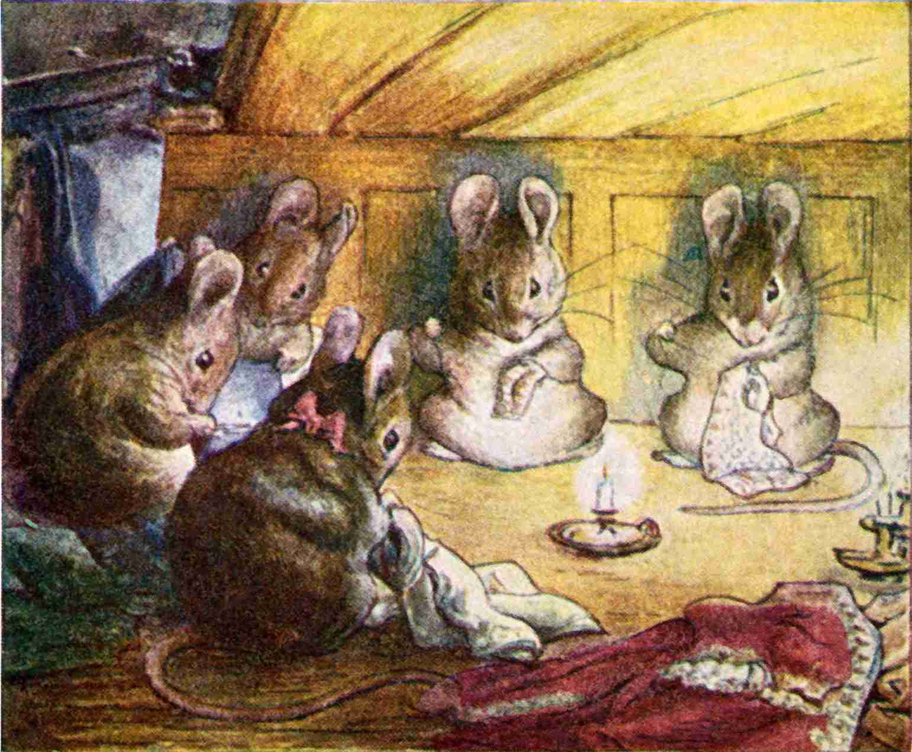
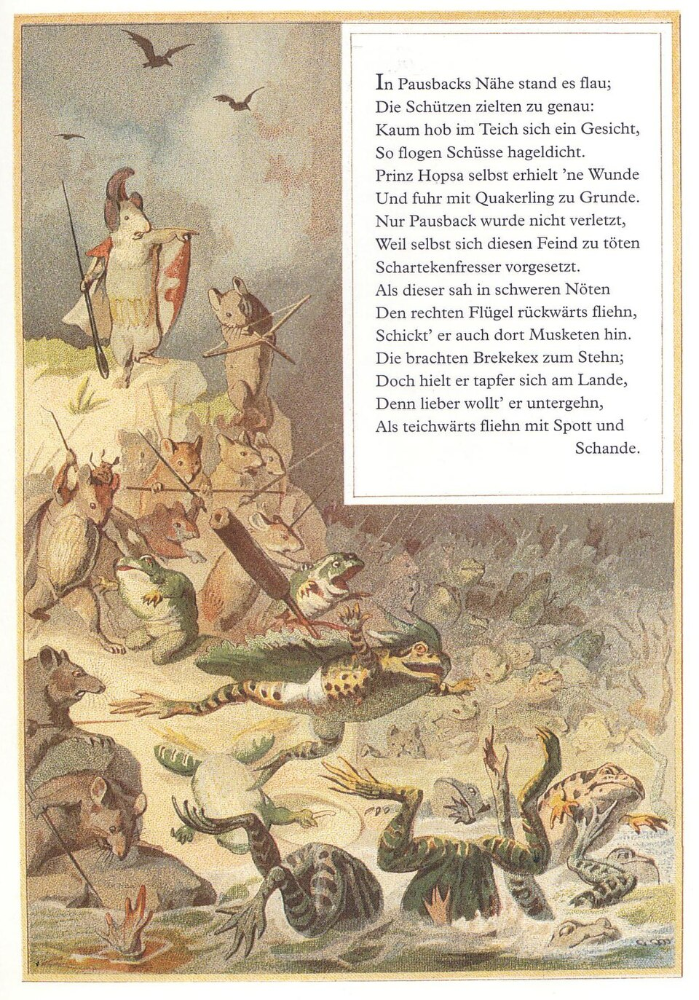
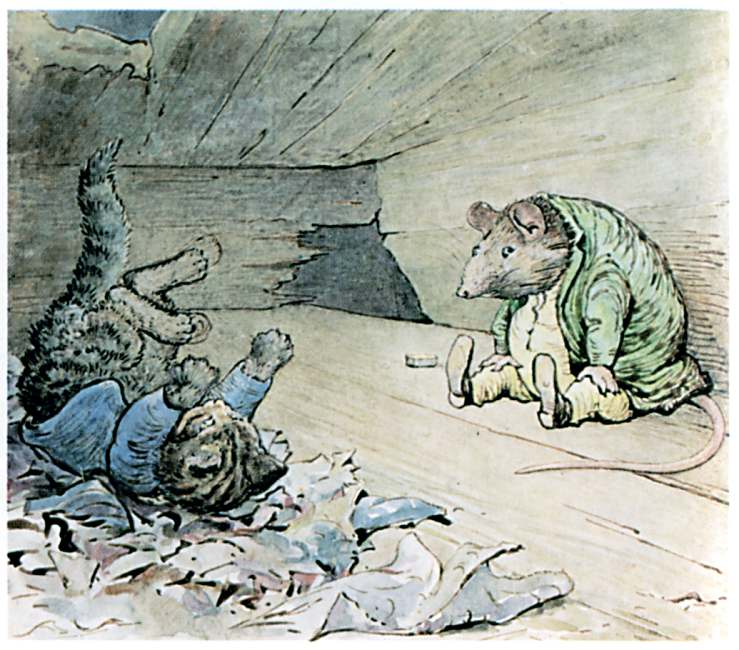
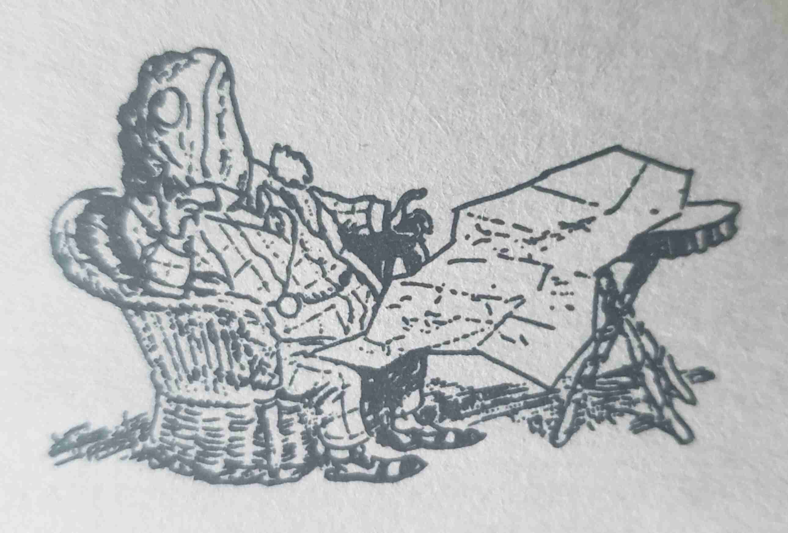

+++
title = "List of Little Folk Stories and Media"
date = 2026-03-08
weight = 3
path = "little-folk-media"
description = "A collection of stories and media that features little folk, whether people or other creatures."

[extra]
image = "bpotter_mice_sew.jpg"

[taxonomies]
tags = ["Tabletop Roleplaying Games", "Small Souls", "Collection"]
ttrpg = ["Small Souls", "Collection"]
+++

This is a non-exhaustive collection of stories and media that features little folk, whether people or other creatures.
I gathered this raw list in my notes due to my interest over the past year in creating my Tabletop Roleplaying Game, Small Souls, which is for telling adventures and scenarios within this genre.
Knowing the different kinds of stories that already exist helps me keep in mind the different tales players may want to tell with the game system.
This really is a genre in itself, which I didn't fully appreciate prior to this proejct!
I think that "Little folk" probably best describes it.

<!-- more -->

## Written Works
### Epics Poems
We start off strong with a comic epic poem parody of the Illiad.
[Batrachomyomachia](https://en.wikipedia.org/wiki/Batrachomyomachia) "Battle of the Frogs and Mice" is a comic epic or parody of the Iliad.
Dating around 5th centiry BC through 2nd centry AD, so alongside ancient works like Aesop's fables and other folklore stories, this is an early contender!

### Children's Books

The children's books written and illustrated by [Beatrix Potter](https://en.wikipedia.org/wiki/Beatrix_Potter) are classic with a nostaligic charm.
    - [The Tailor of Gloucester](https://en.wikipedia.org/wiki/The_Tale_of_Squirrel_Nutkin) 1902
        - Mice finish a tailor's waistcoat in a classic fairytale fahsion.
    - [The Tale of Squirrel Nutkin](https://en.wikipedia.org/wiki/The_Tale_of_Squirrel_Nutkin) 1903
        - The illustrations in this one one are some of my favorite!
    - [The Tale of Peter Rabbit](https://en.wikipedia.org/wiki/The_Tale_of_Peter_Rabbit) 1902
    - [The Tale of Gloucester](https://en.wikipedia.org/wiki/The_Tailor_of_Gloucester) 1902
    - [The Tale of Benjamin Bunny](https://en.wikipedia.org/wiki/The_Tale_of_Benjamin_Bunny)
    - The rest of her [23 Tales](https://en.wikipedia.org/wiki/Beatrix_Potter#The_23_Tales) from 1902-1930 listed on Wikipedia

- [Brambly Hedge](https://en.wikipedia.org/wiki/Brambly_Hedge) series by Jill Barklem since 1980-2020
- [The Butterfly's Ball and the Grasshopper's Feast](https://en.wikipedia.org/wiki/The_Butterfly%27s_Ball,_and_the_Grasshopper%27s_Feast) 1802
    - poem 1802 and children's book 1973 based on the poem. 1974 animated short.
- [Curious George](https://en.wikipedia.org/wiki/Curious_George)_
- [Geronimo Stilton](https://en.wikipedia.org/wiki/Geronimo_Stilton) by Elisabetta Dami in Feb 2004
- If You Give a Mouse a Cookie and the following series.
- Lewis Carroll's "Alice in Wonderland" features shrinking Alice in her adventures in wonderland.
- The Little Warranty People
    - which was the source of the adaptation [The Fixies](https://tvtropes.org/pmwiki/pmwiki.php/Animation/TheFixies)
- [Mrs. Pepperpot](https://tvtropes.org/pmwiki/pmwiki.php/Literature/NineBagsOfGold
) 1956
- [The Secret Book of Gnomes](https://tvtropes.org/pmwiki/pmwiki.php/Literature/Gnomes) 1976 Wil Huygen
    - animated: The World of David the Gnome 1985
- Toby Alone 2023 French author Timothee de Fombelle
- Winnie-the-Pooh, mostly for Piglet who has had the courage to face the world while so very small.

### Short Stories, Folklore
- Aesop's fables
- The Boy, the Mole, the Fox and the Horse
- Thumbelina by Danish author Hans Christian Andersen in Dec 16, 1835.
    - Various adaptations in different forms 1924-2021
    - [Tom Thumb](https://tvtropes.org/pmwiki/pmwiki.php/Literature/Gnomes) 1621 in English. Alluded to in 1584.
- Japanese Issun-boshi are about the size of a thumb
- Mal'chik s Pal'chik (Russia), Little Plum (China), Pulgarcito (Spain),
  Piñoncito (Chile), Cecino (Italy), and Ali g Icher (Algeria).
    - Doll-i'-the-Grass (Denmark), Nàng Út (Vietnam), Maria como un Ajo
      (Spain), Finger-joint (Egypt), and a Cinderella figure named Ditu
      Migniulellu (Corsica)
- [Nine Bags of Gold](https://tvtropes.org/pmwiki/pmwiki.php/Literature/NineBagsOfGold) German Fairy Tale collection.
- Zulu Folklore: Abatwa ride ants and gravely offended if called small.

### Novels
- Animal Farm: A Fairy Story by George Orwell in 1945.
- The Animals of Farthing Wood 1979 by Colin Dann (English)
- [Arthur series](https://en.wikipedia.org/wiki/Arthur_(Besson_book_series)) 2002-2005
- The Borrowers by English author Mary Norton in 1952
- The Brownies and the Goblins by N.M. Banta 1915
    - [Brownies and Bogles](https://tvtropes.org/pmwiki/pmwiki.php/Literature/Gnomes) late 19th century :
        - [some neat art](https://archive.org/details/browniesandbogle39782gut/39782-h/images/) from that book
- Charlotte's Web by E.B White (1952), for the spider and pig perspective
- The Chronicles of Narnia for some small anthropomorphized animals
- Tales From Dimwood Forest Series by Avi (Edward Irving Wortis)
    - Poppy 1995
- [Dunction Wood](https://en.wikipedia.org/wiki/Duncton_Wood)
- [Fantastic Mr. Fox](https://tvtropes.org/pmwiki/pmwiki.php/Literature/Gnomes) by British author Roald Dahl in 1970
- Felix Salten's
    - Bambi, a Life in the Woods 1923
        - Sequel: Bambi's Children 1939
    - [Fifteen Rabbits](https://en.wikipedia.org/wiki/Redwall) 1929:
    - Perri: The Youth of a Squirrel 1923
- Guardians of Ga'Hoole
- Gulliver's Travels 1728 satirical prose novel by Anglo-Irish writer & clergyman Jonathan Swift
    - Introduced the Liliputians for the first time
- [The Littles](https://en.wikipedia.org/wiki/The_Littles) by John Peterson in 1967:
    - Animated series 1983-1985.
- [Mistmantle Chronicles](https://en.wikipedia.org/wiki/Redwall) 2005-2010
- "[The Mouse and the motorcycle](https://en.wikipedia.org/wiki/Redwall)" by Beverly Cleary in 1965 :
- [Mouseheart](https://en.wikipedia.org/wiki/Watership_Down) by Lisa Fielder 2014-2015
- [Redwall](https://en.wikipedia.org/wiki/Redwall) series by Brian Jacques 1986-2011
- The Rescuers 1959 Margery Sharp. Disney film 1977.
    - Sequel "Miss Bianca" 1962
    - Sequel film "The Rescuers Down Under" 1990
- The Secret of NIMH
    - Had a Direct-to-video sequel Dec 2, 1998 "The Secret of NIMH 2: Timmy to the Rescue"
        - Poor reception. "C- grade".
    - There were books, which in classic book-to-film-adaptation fashion, much was lost in the adapatation.
        - [1971 book](https://en.wikipedia.org/wiki/Watership_Down) by Robert C. O'Brien
        - [sequel](https://en.wikipedia.org/wiki/Racso_and_the_Rats_of_NIMH)
- The Spiderwick Chronicles for small fairies. 2003.
- Stuart Little 1945 novel by E. B. White, which the 1999 film was inspired from.
- The Tale of Desperaux by Kate DiCamillo
    - Has a film & a video game
- Terry Pratchet
    - Gnomes in [Discworld](https://en.wikipedia.org/wiki/Watership_Down) by Terry Pratchett, 1983-2015 :
        - [Wee Mad Arthur](https://en.wikipedia.org/wiki/Watership_Down) 1989-2011
    - The Nome Trilogy (The Bromeliad Trilogy)
    - The Carpet People, where carpet hair is as large as a tree
- Warrior Cats
- [Watership down](https://en.wikipedia.org/wiki/Watership_Down)
    - Similar works
        - [The Constant Rabbit](https://en.wikipedia.org/wiki/The_Wind_in_the_Willows) 2020 sci-fi by Jasper Fforde (English)
- [Welkin Weasels](https://en.wikipedia.org/wiki/Garry_Kilworth#Welkin_Weasels)
- [Wind in the Willows](https://en.wikipedia.org/wiki/The_Wind_in_the_Willows)
    - Little emphasis on being small, with varying unrealistic sizes.
        - Toad drives and crashes a human made car, afterall.

## Sequential Art
### Comics
- The Adventures of Peter Wheat by Walt Kelly 1948-1956
- Blacksad
- [The Bird feeder](https://thebirdfeeder.com/)
- [Breaking Cat News](https://www.breakingcatnews.com/)
- Mutts
- [Mouse Guard](https://en.wikipedia.org/wiki/Mouse_Guard) comic series
    - [TTRPG based](https://rpggeek.com/rpg/799/mouse-guard) on the Burning Wheel TTRPG.
    - [Board game](https://boardgamegeek.com/boardgame/162315/mouse-guard-swords-and-strongholds)
- [Scurry](https://www.scurrycomic.com/) webcomic 2016
    - A very cool web comic of mice surviving. Original sotry is finished, and some more on the way.
- Professor Schimauski by German artist Walter Moers disocovered his toaster worked due to a little dragon in it.
- The Smurfs
- [The Teenie Weenies](https://en.wikipedia.org/wiki/Arrietty) 1914-1964

### Manga & Anime
Japanese manga, anime, graphic novels, and sometimes their related light novels
- [Chiikawa](https://en.wikipedia.org/wiki/Chiikawa)
- [Hakumei and Mikochi](https://en.wikipedia.org/wiki/Hakumei_and_Mikochi)
    - a slice-of-life of little folk and their tiny little life in the woods.
- [Hamtaro](https://en.wikipedia.org/wiki/Hamtaro)
- [Ichigeki Sacchu!! Hoihoi-san](https://tvtropes.org/pmwiki/pmwiki.php/Manga/IchigekiSacchuHoihoiSan)
    - Robot dolls fight pesticide resistant insects. Hilarious.
- [Kabu no Isaki](https://tvtropes.org/pmwiki/pmwiki.php/Manga/KabuNoIsaki) a world x10 bigger than ours
- [The Littl' Bits](https://en.wikipedia.org/wiki/The_Littl'_Bits) 1980
- Studio Ghibli's [Arrietty](https://en.wikipedia.org/wiki/Arrietty)
- [Usagi Yojimbo](https://en.wikipedia.org/wiki/Usagi_Yojimbo) (Rabbit Bodyguard) by Stan Sakai in 1984-present
    - anthropomorphic, but not small. Too cool not to include though.

## Film
### Animated Film
#### Disney
- [A Bug's Life](https://en.wikipedia.org/wiki/A_Bug%27s_Life) 1998
- [The Aristocats](https://en.wikipedia.org/wiki/The_Aristocats)
- Chip 'n Dale Rescue Rangers animated series 1988 - 1989
    - Novel series: The Mouse Watch 2020-2022
- [The Great Mouse Detective](https://en.wikipedia.org/wiki/The_Great_Mouse_Detective) 1986
- [Ratatouille](https://en.wikipedia.org/wiki/Ratatouille_(film)) 2007
- [Toy Story](https://en.wikipedia.org/wiki/Toy_Story) series
- [Zootopia](https://en.wikipedia.org/wiki/Zootopia) 2016 and [Zootopoia 2](https://en.wikipedia.org/wiki/Zootopia_2) 2025

#### Universal Pictures
- "[An American Tail](https://en.wikipedia.org/wiki/An_American_Tail)" 1986
    - franchise: 1991, 1992, 1998, 1999
- [Oswald the Lucky Rabbit](https://en.wikipedia.org/wiki/Arrietty), took over by Universal Studios

#### Dream Works
- [Antz](https://en.wikipedia.org/wiki/Antz) 1998

#### Other
- Capitol Critters animated series 1992
- [Epic](https://en.wikipedia.org/wiki/Arrietty) 2013
    - lackluster reviews, but neat lilliputian warrior riding armored hummingbird!
- Pinky and the Brain 1993-2020

### Movies
- Honey, I Shrunk the Kids (1989)

## Games
### TTRPGs
There is a notable surplus of creature specific games here mostly targeting mice, bugs, and little fairies as per The Borrowers.

- [Beetle Knight](https://brookletgames.itch.io/beetle-knight-quickstart)
- [Bunnies & Burrows](https://en.wikipedia.org/wiki/Bunnies_%26_Burrows)
    - Inspired by the 1972 novel "Watership Down"
    - Inspired or spiritual successor: [The Warren](https://rpggeek.com/rpgitem/175766/the-warren)
- [Crash Pandas](https://gshowitt.itch.io/crash-pandas), by Grant Howitt, creator of the similarly fun and funny game "Honey Heist".
    - >You're a bunch of raccoons, all tryiing to drive the same car looking to make their names in the dangerous world of LA street racing.
    - The size difference of being racoons in a human made car is the gimmick and a good one at that!
- [Golden Sky Stories](https://rpggeek.com/rpg/2428/yuuyake-koyake) 2013.
    - A heartwarming, cozy slice-of-life game.
    - Little to no emphasis on being small in design
- [Household (TTRPG)](https://rpggeek.com/rpg/58672/household) 2019 inspired by The Borrowers, roleplay as Littlings of a house abandoned by its human owners.  Looks like you ride  and fight mice and rats, so that's neat. I do think some of these other bug TTRPGs are rivaling it for the title of "The Worlds Smallest Roleplaying Game". Heh heh.
    - [2nd edition](https://rpggeek.com/rpg/75931/household-2nd-edition) 2022
    - [Quickstart](https://www.drivethrurpg.com/en/product/421014/household-quickstart)
    - The art and writing of this book is enchanting!
- [Mausritter](https://rpggeek.com/rpg/61196/mausritter-sword-and-whiskers-role-playing) 2020. Play as mice knights on grand looting adventures.
    - [Systems Reference Document](https://mausritter.com/srd)
    - They made the [PDF free](https://losing-games.itch.io/mausritter).
    - An immense [library of third part content](https://library.mausritter.com/).
    - My itch.io list of [Third party content with different animals](https://itch.io/c/5911935/mausritter-player-characters) if you're interested in that like I was.
    - [Lilliputian](https://rpggeek.com/rpg/104054/lilliputian-adventure-on-the-open-seas) 2022, a Mausritter hack/extension with emphasis on seafaring Lilliputians
        - [Demo](https://manadawnttg.itch.io/lilliputian)
- [Mausworn](https://capacle.itch.io/mausworn) is a hack of Mausritter + Ironsworn and is currently in pre-release.
- [Mouse Guard TTRPG](https://rpggeek.com/rpg/799/mouse-guard) on the Burning Wheel TTRPG.
- [Pico](https://rpggeek.com/rpg/113956/pico): Tiny Bugs, Big World 2025
    - [Playtest Quickstart](https://felixisaacs.itch.io/pico-hogwild-playtest-pre-gens)
- [Root (TTRPG)](https://rpggeek.com/rpg/57447/root-the-roleplaying-game), which is Powered by the Apocalypse.
    - Little to no emphasis on being small in design
    - Although not much emphasis is put on size of the creatures.
    - Root TTRPG [Quickstart](https://www.drivethrurpg.com/en/product/378106/root-the-rpg-bertram-s-cove-quickstart). There are other quickstarts for free on DriveThruRPG too
- [The Small Folk](https://tvtropes.org/pmwiki/pmwiki.php/TabletopGame/TheSmallFolk) 2015. Uses the Fate Game System.
- [Under the Floorboards](https://loottheroom.itch.io/under-the-floorboards) tiny people living in a hostile world inspired by The Borrowers.
- [Wanderhome](https://rpggeek.com/rpg/68792/wanderhome) A diceless game about traveling and finding your home.
    - A heartwarming, cozy slice-of-life game, with the option for melancholy and reflection.
    - Little to no emphasis on being small in design
    - [Free Playkit for kickstarter](https://possumcreekgames.itch.io/wanderhome-playkit)
    - Some [third party content](https://itch.io/c/6044778/wanderhome) that caught my eye.

### Boardgames
- [Everdell](https://rpggeek.com/rpg/57447/root-the-roleplaying-game) 1-4 players, 6 with expansions, 2018
- [Mice & Mystics](https://en.wikipedia.org/wiki/Mice_and_Mystics)
- [Mouse Guard Board game](https://boardgamegeek.com/boardgame/162315/mouse-guard-swords-and-strongholds) also has a TTRPG above
- [Root](https://boardgamegeek.com/boardgame/237182/root) 2-4 (or 6 with expansions) boardgame which also has a TTRPG above

I found this amusing. Magic: The Gathering realm of [Segovia](https://mtg.fandom.com/wiki/Segovia) a plane where 1/100 the size of the main world. Leviathins are 3/3 and smol.

### Video Games
- [Another Crab's Treasure](https://en.wikipedia.org/wiki/Bugdom), 2024 Soulslike
- [Bugdom](https://en.wikipedia.org/wiki/Bugdom) 1999
- [Chipmonk!](https://en.wikipedia.org/wiki/Bugdom) 2018 Beat 'em Up
- [Ghost of a Tale](https://en.wikipedia.org/wiki/Ghost_of_a_Tale) 2018
- [Grounded](https://en.wikipedia.org/wiki/Grounded_(video_game)) : 2022 survival
- [Hollow Knight](https://en.wikipedia.org/wiki/Hollow_Knight) 2017 and Silksong 2025
- [It Takes Two](https://en.wikipedia.org/wiki/It_Takes_Two_(video_game)) 2021
- [Lemmings (Video Game)](https://en.wikipedia.org/wiki/Lemmings_(video_game)) 1991
- [Small Saga](https://tvtropes.org/pmwiki/pmwiki.php/VideoGame/SmallSaga) Nov 16, 2023
- [Sneakers](https://en.wikipedia.org/wiki/Sneakers_(2002_video_game)), Xbox game 2002
- [Toy Odyssey: The Lost and Found](https://tvtropes.org/pmwiki/pmwiki.php/VideoGame/ToyOdysseyTheLostAndFound) 2016
- [The Legend of Zelda: The Minish Cap](https://en.wikipedia.org/wiki/The_Legend_of_Zelda:_The_Minish_Cap) 2004

## Conclusion

Creating this list helped me find other stories within this genre that I would like to read or view or play.
Perhaps it will help you similarly.

Perhaps for fun, I'll turn this into a table of entries with some categorization of their properties, instead of a list like this.

### Collaborative Collecting
This list started from a small community discussion in the [NSR RPG Cauldron Discord](https://discourse.rpgcauldron.com/) back in mid January 2025.
Some of these people includes
- [Jay White](https://cara.app/draworbedrawn).
- Lyth,
- Max,
- [Rick](https://atellingellipsis.bearblog.dev/),
- [RKaitz](https://josephkrausz.substack.com/), and
- [seedling](https://seedlinggames.com/).

They are a few of many kind and passionate people over at the Cauldron.
A good community that I'm glad was recommended to me.

I have since extended that initial list greatly by doing my own research and finding some other existing lists online, and some recommendations by others over the year.
Peruse these other lists to your hearts content:

#### Wikipedia
I found it incredibly amusing that Wikipedia has its own page for just [Little people (mythology)](https://en.wikipedia.org/wiki/Little_people_(mythology))!
I found it mostly useful for exploring smaller fairytales and fairies beyond my own experience.

#### tvtropes.org collections
I was previously uninterested in tvtropes.org at a glance until it kept getting mentioned by [Boss Jaba the demilich](https://demilich-productions.itch.io/) in the Cauldron.
I can say the tvtropes.org wiki is contains many *excellent* lists across many topics!
Some of their little folk trope pages:
- [Lilliputians](https://tvtropes.org/pmwiki/pmwiki.php/Main/Lilliputians)
- [Lilliputian Warriors](https://tvtropes.org/pmwiki/pmwiki.php/Main/LilliputianWarriors)
- [Mouse World](https://tvtropes.org/pmwiki/pmwiki.php/Main/MouseWorld)
- [Sewing Needle Sword](https://tvtropes.org/pmwiki/pmwiki.php/Main/SewingNeedleSword)
- [Tiny Tropes](https://tvtropes.org/pmwiki/pmwiki.php/Main/TinyTropes)

#### Others

- [Novels Featuring Miniature People](https://www.goodreads.com/list/show/23493.Novels_Featuring_Miniature_People), but not necessarily focused on them:
    - > I made this list because I love stories of little people interacting with objects made for larger people (e.g. Thumbelina's cot is a walnut shell and the Borrowers use thimbles for cups and live in walls) and was hoping the Goodreads community would add some similar stories as recommendations.
      > - by Diana
- year 2000s onwards [books including anthropomorphism](https://writingatlas.com/tag/anthropomorphism/)
- [Scholastic teachers' top 100](https://brookletgames.itch.io/beetle-knight-quickstart) chapter books poll, will include anthropomorphic animals
