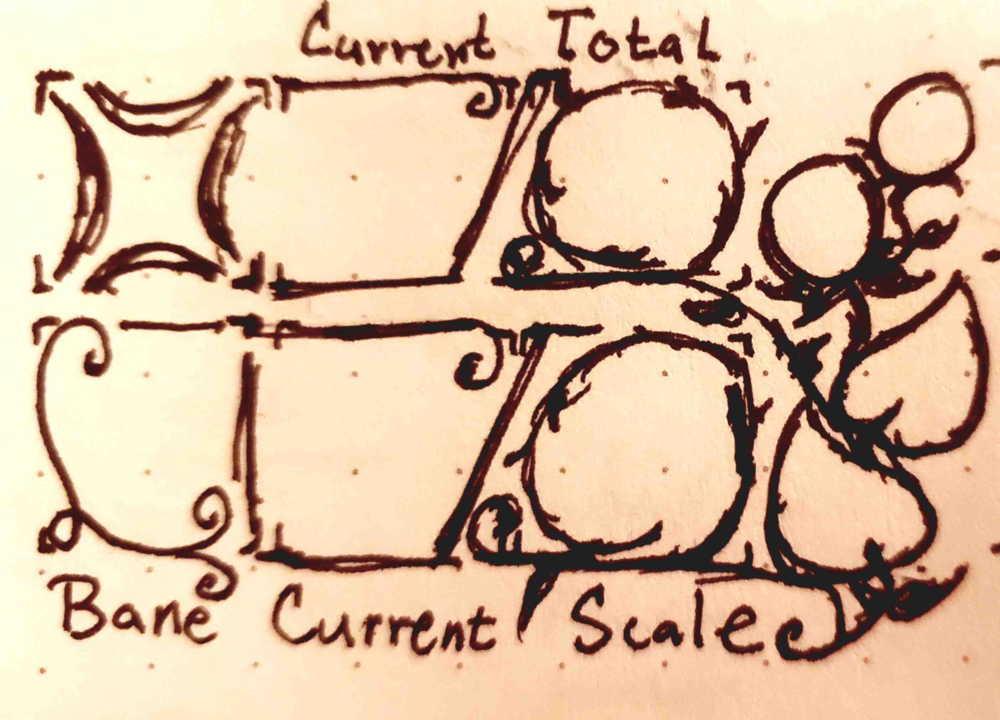
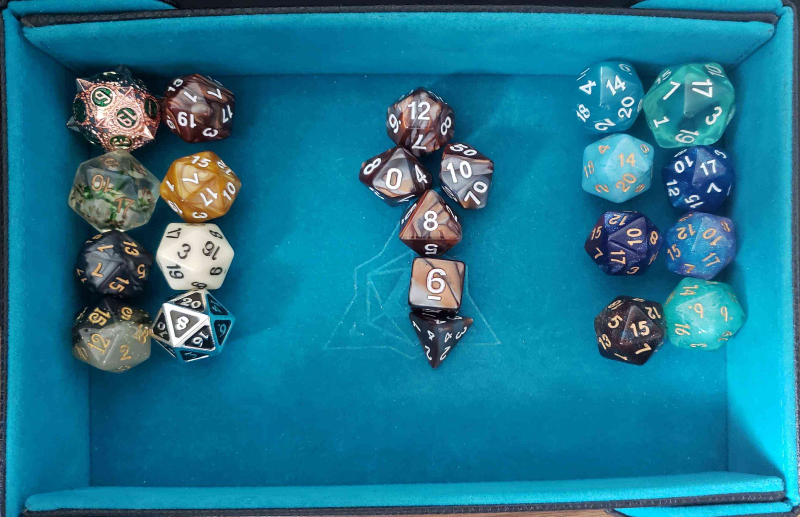
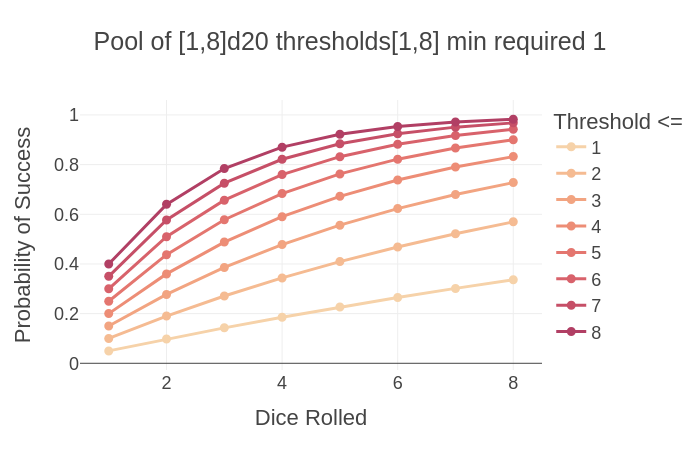
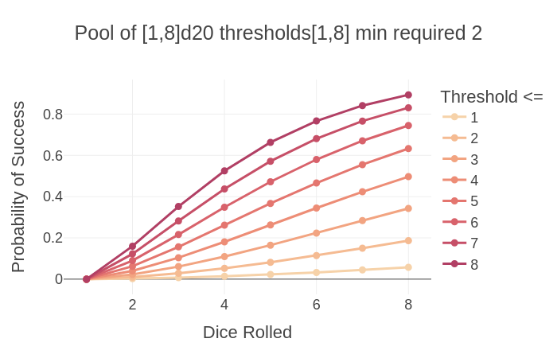
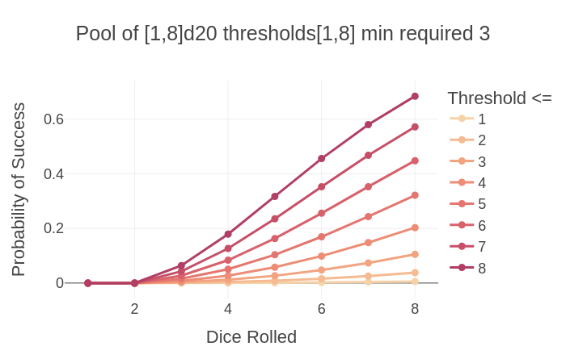
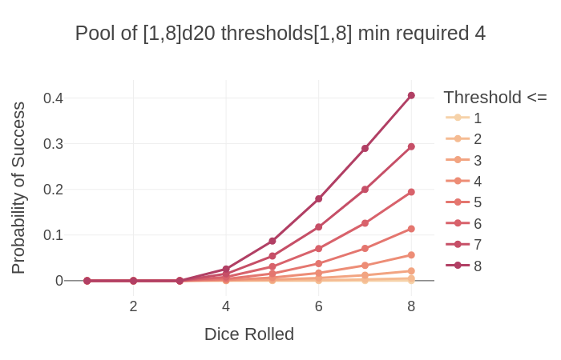

+++
title = "Relative Resolution in Small Souls"
date = 2026-03-29
weight = 3
path = "relative-resolution-in-small-souls"
description = "The resolution mechanics and character specification of Small Souls and a wee bit more."

[extra]
image = "sketch-of-vigor-aspect-sheet.jpg"

[taxonomies]
tags = ["Tabletop Roleplaying Games", "Small Souls", "Soul System", "Design", "WIP", "Tiny Epics"]
ttrpg = ["Small Souls", "Soul System", "Design", "WIP", "Tiny Epics"]
+++

After sharing my [design goals](@/soul_system/design_goals/index.md), I am glad to share the character specification and core resolution mechanic behind Small Souls, and really its underlying generic engine, Soul System.
As of version 0.2.0, Small Souls is a TTRPG with a roll-under counted dice pool and two thresholds that determine if those rolled dice are boons, banes, or blanks.
This resolution mechanic quantizes the spectrum between automatic success and automatic failure, while providing different parameters to tune for more things to occur as side effects, whether good or bad.
It provides a simple interface for players to improve their odds by first improving the narrative situation in their favor, possibly avoiding a roll altogether, or by using their resources to improve their odds or push their luck by rolling more dice.
This is a forward moving mixed outcome resolution system that is designed for optional advancement in these abilities for higher level play, if so desired.
Let's dive in!

<!-- more -->

Sketch of the 💢 Vigor aspect on a mock Small Souls character sheet. Current/total value on top. Bane range, and current/total scale on bottom. The leaves are total resilience and circles above are current resilience. Resilience has 3 states: empty, 1, and 2 filled.

>**Edit 2026-04-01:** Perhaps the joke's on me for not including this in the original post, but I included how 💢 Vigor and 💨 Agility adjust with [Physical Scale](@/soul_system/relative_resolution/index.md#physical-scale-and-aspects) to help showcase a common occurrence of difference between scale using my current size classes, which scale by powers of 2.
This clarifies how a task befitting a giant may be translated relatively to a normal human, and similarly for a badger to mouse.

## A Character's Aspects

There are four aspects that determine a character's base abilities.
These are split into physical and mental aspects each with a pair of approaches, force and finesse.
I'm using iconography to help make creature sheets more concise.

|| Aspect | Type | Approach | Description |
|-|---|---|---|---|
| 💢 |Vigor | Physical | Force | Strength, constitution, & robustness  |
| 💨 |Agility | Physical | Finesse | Nimble reflexes & dexterity |
| 🧠 |Wits | Mental | Finesse | Senses, awareness, & mental acuity |
| ⚝ |Spirit | Mental | Force | Determination, resolute will & charisma |

Worth noting that I started Small Souls by hacking on Mausritter back in early 2025, which is probably my favorite Into the Odd-like followed by Mythic Bastionland (I've yet to try or look into "Block, Dodge, Parry" but its on my radar), and you'll notice I swapped two of the main three to Mythic Bastionland's terms, which was a mix of I guess the same thought process for Spirit and then our mutual appreciation of Dark Souls' Vigor stat.
I saw they used vigor and I thought, "Oh yeah. I kinda can't not use that."
My game is called Small *Souls*, after all.
I find these aspect names are more general and descriptive than the classic strength, dexterity, and will.

These do not cover the concepts of wisdom or intelligence, besides perhaps that a higher wits aligns with a higher intelligence in terms of mental processing.
To me, intelligence is the efficiency of one's learning new things and wisdom is the resulting knowledge gained through experience, often referring to more general things learned through a long life with reflection.
The aspects don't cover experiences, skills, or knowledge.
Those are handled on their own later and tend to improve one's abilities set by their aspects in specific scenarios.

Every aspect includes the following state and inform the outcomes of the **d20s** in your dice pool per save.
- **Aspect Value**: A value from [1, 8]. Rolls less than or equal to this value are boons.
    - Current
    - Total
    - Average is 4. These are rolled using **2d4** keep highest and second is divided by 2 then added to the other. There is also a point build system.
- **Scale**: Your relative scale to the typical creature's scale.
    - Current
    - Total: Starts at 0 unless you're in a game starting with some higher scaled aspects.
- **Resilience**: The extra hits to an aspect you can take before decrementing an aspect value. Also tracks progress in increasing your total aspect value.
    - Current
    - Total: I set this to min 0 and max 2.
- **Bane Threshold**: Rolls greater than or equal to this value are banes in the dice pool. Default is 20.

Soul System makes good use of my d20s, especially in soloplay!

## Relative Resolution

The resolution mechanic is a counted dice pool where the goal is to roll-under your aspect value.
The dice pool starts with **2d20** and maxes out at **8d20**, where these are *counted*, not summed.
The player may use character equipment, skills, or relevant experiences to improve their odds of success prior to making the save.
Those may add more dice to the pool, which means there is more chance for things to go right, as well as more things that could go wrong, albeit less likely depending on the bane range.

The relative difference in scale of saves is the key behind relative resolution:
- <= -1: Automatic success: Your ability is beyond this task in this situation.
- 0: Automatic success, *but* we roll for how well you succeed and any side effects.
    - You may succeed in sneaking away, but how obvious are your tracks?
- Minimum required boons:
    - 1: Standard, the default case when uncertainty, consequences, and limited time are in play.
    - 2: Difficult
    - 3: Incredibly difficult, unlikely to succeed if your aspect is at or below 4 (max probability of a success for 8d20 <= 4 is ~20%).
    - 4: Rarely used.  Failure is very probable for most. 8d20 <= 4 is 5.6%.

This provides a spectrum of possibilities between automatic success and automatic failure, which is nice in games where you want players to just be able to succeed at something because they are more than capable, or you want something in between.

*Any* banes means *something* went wrong.
The higher the difference in scale, the character is *exponentially* less likely to succeed!
This phenomena occurs in classic single threshold 1d20 games as well.
Disadvantage (roll 2 keep worse) is much more dramatic absolute difference in probability than advantage (roll 2 keep best).

The probability of success is low in this game by default, but when you earn or spend to have more dice, then you can improve your odds.
The average default case is 2d20 <= 4 and has a probability of success at 36%.
2d20 <= 8 is 64% probability of success, which is similar to the 65% probability of success in DnD 5e for characters that are [good at something](https://rpgbot.net/dnd5/characters/fundamental_math/).
Although, I have been considering maxing at an aspect total of 7 per scale.

I'll write up an analysis of the probability of this counted dice pool among other dice pool mechanics in the future.

As a mixed outcome dice pool, this results in the following outcomes:

1. **Yes, ...** if enough boons, then a successful save.
    1. **and...** if extra boons, then extra benefits.
    2. **but...** if any banes, then drawbacks.
2. **No, ...** if not enough boons, then a failed save.
    1. **but...** if any boons, then some benefits.
    2. **and...** if any banes, then more drawbacks.

To move the narrative forward, ensure that the blank fail state without boons or banes still results in a state change, depending on if the save  was in favor or disfavor of the character.
A tough thing about mixed outcome results is to have enough ideas for what would be the different outcomes in you situations on the fly.
I'm working on examples for common cases to help give people ideas.
Often, as the dice are tied to some source, things going wrong can harm that source, such as temporary ailments toward an aspect or damage equipment.
For extra benefits, I often provide extra information or improve their narrative positioning even further than a normal save would.

### Physical Scale and Aspects

Small Souls currently uses size classes to determine the physical scale of creatures, which follows scaling by powers of 2.
The names are currently with reference to a creature of 3-6 inches tall, which is my default creature size in Small Souls.
However you name them or whatever reference scale you play, these help inform the relative difference in size.

| Size        |Relative Scale| Map Area     | Reach   | Height          |
|-------------|--|--------------|---------|-----------------|
| Fine        |-4| 3/8 in²        | 3/8 in      | 3/16–3/8 in         |
| Diminutive  |-3| 3/4 in²        | 3/4 in      | 3/8–3/4 in            |
| Tiny        |-2| 1½ in²       | 1½ in     | 3/4–1½ in           |
| Small       |-1| 3 in²        | 3 in      | 1½–3 in           |
| **Medium**  |0| 6 in²        | 6 in      | 3–6 in            |
| Large       |1| 12 in²       | 12 in     | 6–12 in           |
| Huge        |2| 24 in²       | 24 in     | 12–24 in          |
| Gargantuan  |3| 48 in²        | 48 in     | 24–48 in          |
| Colossal    |4| 5 ft²        | 5 ft      | 4–8 ft            |

Using medium as the reference point, A medium sized mouse is one size class smaller than a large rat.
This puts the mouse at scale 0 and the rat at scale +1 in Vigor.
The reverse for Agility, the mouse is scale 0 and the rat is -1 in Agility.
The relative scale difference changes linearly, however the probability and the physical scaling all scale exponentially.
In my early versions, a scale difference greater than 2 to be an automatic failure, which would require more than 3 boons to succeed (Add 1 to relative scale to get the minimum required boons for standard difficult tasks at that scale).
This nearly matches that of Mausritter's war band sized threats like a cat is to a mouse.
I may make the relative scale more drastic in the future, but it depends how I like the probability across the scales along with how I it changes with relevant experience.

### Assistance and Group Rolls

A character may attempt to assist another as long as they can justify how they do so in the narrative.
They then roll their own save using the appropriate aspect at their own relative difficulty.
As long as one of the characters meet their minimum required boon, then the group save succeeds.

### Clashes: Opposed Rolls

Clashes occur when two characters oppose one another.
1. **Both Win**: Both succeeded their save. A win-win tie event occurs. If one side had more boons than the other, then the conflict ends partially in their favor. If both parties wish, they may double down and continue the clash for greater risk and reward.
2. **Side 1 Wins**: Side 1 succeeded their save and side 2 failed.
3. **Side 2 Wins**: Side 1 failed their save and side 2 succeeded.
4. **Both Lose**: Both failed their save and the conflict dissolves. If one side had more boons, then it dissolves in their favor.

### Character Progression

Character progression in their aspects is optional.
A character levels up through experience in Small Souls by tallying the use of an aspect between rests.
If a character has proper rest covering their needs, then they may level up an aspect if it was used enough.
Typically incrementing the total resilience.
When both leaves of resilience are full, then the aspect total value increases and the resilience leaves are cleared.
When an aspect is at the max value, currently 8 for a scale, then the next value increase wraps around to 5 and the scale increases.
This leaves 4 aspect values per scale to level up through.
If I decide to remove 8, then 7 is the new max and instead of 5, the first value in higher scales is 4.
These values were chosen such that the lowest value (4 or 5) for a scale is always better than the highest value for the scale below (7 or 8).
Dropping below the lowest value for a higher scale will decrement your scale setting you back to the max value for the prior scale.
When your value is below 4, then you are weak for that natural scale.

## Defenses

A character's defenses include Heart, Armor, and Retaliation.

### ❤️ Heart

Heart is the primary resource for pushing oneself to succeed.
You can think of it as a character's energy or stamina.
It is the combination of the concept of traditional hit points and stress from Blades in the Dark.
I currently use the cost of one heart to add one die to a roll.

Heart also can be used to mitigate damage.
Every attack always has a targeted aspect, but heart may be spent to reduce the effect of that damage on one's aspect.
Currently, I still have wounds occur even if heart is used to take on all the damage.
This makes it worth using heart for the chance to mitigate a wound in the first place using a save.
Although I am currently experimenting with wounds and how heart can be used to prevent or weaken them.
Heart is a strong resource and is the primary one until you're at the end of your ropes pushing yourself at the cost of your aspects, which results in a downward spiral.

### 🛡️ Armor

The reduction to damage received.
If not just a flat reduction, I often type it to physical damage.
This armor can be typed to resist certain types of damage, but that is opt-in complexity for people who like combat games like Pathfinder 2e (Me. That's me. I'm talking about me).
Damage is technically always typed by the aspect they are targeting, as that informs the type of wounds one can receive and which aspect gets effected.

### ⤤ Retaliation

The damage that an attacker takes when they hit you.
This is often just zero.
Similarly to armor, you can make this as simple or as complex as you want.
Hedgehogs are a prime example of 1 piercing retaliation damage when defensively curled up or attacked from behind.
Also fun to include a "spin attack" by throwing themselves at their enemies as they curl up.
Heh heh.

## Wounds

The above character state and resolution mechanic already do wonders as is.
I am exploring wounds instead of just loss of heart and aspect values.
I enjoy the concept of wounds, especially when using a character sheet designed like Mausritter where you can see them right in your face telling you that wasn't just -5 heart, that was a bleeding laceration or demoralizing vicious mockery that leaves you crestfallen.
Even when you have minor wounds that are just cuts and scrapes, those make swimming in the salt water to get away all the more grueling.
This could too easily be forgotten if it was just abstracted away as -5 heart.
I have enough thoughts here to write up another post on Harm -> Wounds -> Scars.

The types of wounds I have right now are the following:

|Value |Wound| Severity |
|------|---------|---|
[1,2] | Minor   | No active penalty, but can worsen.|
|[3,6] | Moderate| Minor negative effects and needs treated.|
|[7,9] | Major   | Major negative effects. May die if untreated.|
|[10,11]| Mortal | Will die unless treated.|
|>=12  | Mortem  | Dead or will die unless by some miracle.|

What is neat about these, is they can be determined from a single roll of the attacker's dice pool when determining if the attack hits, resulting in only one roll!
If they auto hit, then you round up the aspect value to the closest even polyhedral die.
This helps keep the amount of rolling down even though we may roll to hit at times.

The way to determine the wound is the attacker picks one of their boons as the wound value and then the rest serve as a currency for either another wound by counting (not summing) them up or to use a combat maneuver such as shove, trip, disarm, or grapple.
I'm currently figuring out a proper price for combat maneuvers.
This approach can be used similarly for breaking up the result of a auto hit if desired.

To clarify, your aspects take values within [1, 8] and so your max damage is tied to your aspect value, which is also responsible for your probability to hit.
This could be undesirable, but I think it needs playtested further to find out.
To get higher values, you would need better position that would increase your relative scale or decrease the difficulty, such as coup de grace in DnD, where I currently use extra scales to just add to the resulting roll, so the floor and ceiling increase together.
Otherwise, currently your weapons increase the upper end of probabiltiy up to 12 maximum, as that's deadly.
This means that damage are quite low, though typical for a game using d12s as the harder hitting weapons.
Dealing severe wounds are the competitive tactic, as those end the game.

In opposed rolls, the defender's boons may be used to remove their choice of the attacker's boons, which will tend to be their highest dice to avoid the more severe wounds.
Banes also serve as the opponent's currency for combat maneuvers, which include a counter attack, and makes combat far more risky for all involved.
This was incredibly fun in both soloplay and at my table!

The total wounds (greater than minor) a character can carry is based on their inventory, which we have split between physical and mental (I probably should make a post on one's mind as mental inventory, but the cat's out of the bag now!).
In the future I intend the aspects to effect inventory slots, but for now we simply use 10 total with two for hands, two for belt, and six carried, much like Mausritter.

In Small Souls, different creatures can have different types and numbers of slots.
For example, birds have a beak, two feet slots, and one belt slot.
In v0.1.0, I had them carry less too, but tying physical inventory slots to Vigor will probably result in a similar limitation.
Birds tend to be weaker than mammals of their size and so can take less hits and carry less than them.
This makes them the natural glass cannon, as they can swoop and do fly by attacks with their face knife or feet knives.

### Downed & Incapacitated

When an aspect becomes 1 or the character experiences aspect loss greater than or equal to half rounded up their aspect's current value, then the character is **downed**.
They have only one Action and one Reaction per turn and can slowly crawl, use an item, or speak.
If they attack, then in their strain they gain a befitting wound.
Downed characters need tended to to get back up, even if their aspect value remains at 1.

If an aspect is 0, the character is incapacitated befitting the aspect:
- If Vigor is 0, then they are **unconscious**.
- If Agility is 0, then they are **immobilized**.
- If Wits is 0, then they are **stupefied**.
- If Spirit is 0, then their **spirit is broken**.

## Conclusion

In practice, I have found this resolution mechanic to be very quick!
It can be quite satisfying as it is the same flexible mechanic that can be used across many different scenarios.
Combat maneuvers of grace, to headstrong stalwart defenses, to hacking in netspace, to an overpowering spirit that shatters the opponent's through nothing but an exchange of words.
The nuance of this game mechanic is what makes it so fun for me.
Itself is something to play with!

There is more work to be done, however it is already quite promising in both concept and play.
Some things I am currently working on include:
- Ailments: This character specification informs the different types of negative effects we can afflict on a character, while typically avoiding aspect loss as that's assumed to be a given when acquiring wounds. This leaves expanding the bane range per aspect, decreasing an aspect's scale, or decreasing an aspect's total resilience. I have also considered extra bane dice that the narrator rolls to compare against the character's bane range.
    - Harm -> Wounds -> Scars
    - Panic! and other horror elements.
        - Currently Panic! is in reverse to the wounds table. The lower your aspect, typically Spirit, the worse panic conditions become available. Fear can worsen panic outcomes.
    - Cure conditions and timing across sessions. I want heart to heal faster, but wounds and ailments to linger a bit to make those consequences matter.
- Experience & Equipment
    - How to simplify the use of equipment and experiences to determine difficulty of rolls on the fly.
        - This is adding in complexity that is ultimately opt-in. It gets complicated when we have multiple scales due to varying experiences and opposed rolls.
        - Whether to go with ~3 scales versus ~5 in experience:
            - Unintuitive, Inexperienced, Apprentice, Journier, Expert, Master, Legendary.
    - How to transition more fluidly in-between scales for conditional cases.
        - Mostly related to my prior point, as the answer is increase/decrease dice or the scale, but should I consider or explore increment/decrement the aspect value itself? I'm leaning towards no.
    - A classless skill tree or planar directed acyclic graph that is inspired by Shadowrun's classes skills featuring breadth and depth.
- Balancing the resource economy over the session and in timed challenges.
    - Too much heart and not enough pressure means the aspects don't take damage and then require the Narrator to apply more pressure to keep up the tension.
    - I currently think risking aspect damage and taking some damage or wounds in one session is the goal for higher tension. This is the draw of Blades/Forged in the Dark for me.

But for now, that's Small Souls' core character specification and resolution mechanic!
